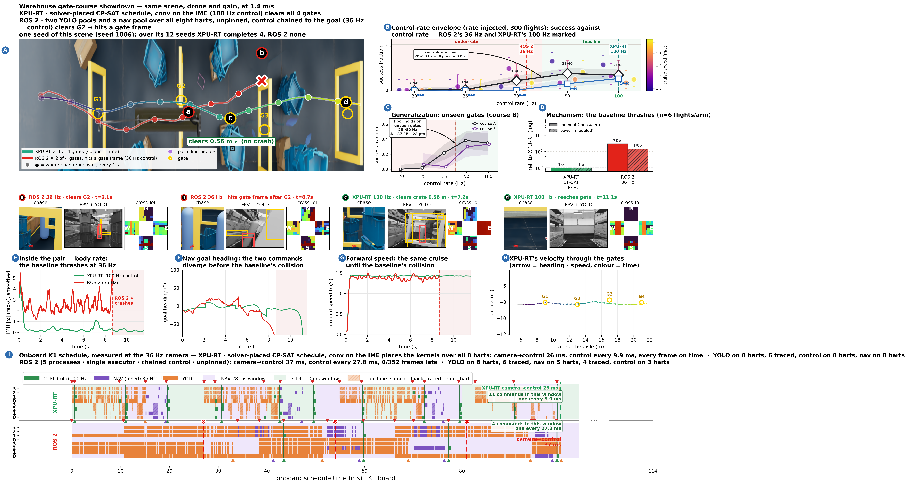

# showdown_36hz_solver_vs_rosallhart_s1006

The control-rate floor against the strongest all-hart baseline we have measured: two YOLO pools and a nav pool over every hart, so nothing in the perception chain runs alone. The baseline clears two gates and loses the course at the third.



Full size: [`showdown_36hz_solver_vs_rosallhart_s1006.png`](../../../../results/codesign_feedback/refined/showdown_36hz_solver_vs_rosallhart_s1006.png) · [`.pdf`](../../../../results/codesign_feedback/refined/showdown_36hz_solver_vs_rosallhart_s1006.pdf) · sidecar `metrics.json` in this directory.

## The two arms

| | arm | camera→control | control rate | census (completed/12, mean gates) |
|---|---|---|---|---|
| XPU-RT | `p36freer` via `xpu_p36free.csv` | 25.82 ms | 102 Hz | 4/12, 2.67 |
| ROS 2 | `('vanilla4x2ns4c', 36)` via `ros_vanilla4x236ns4.csv` | 37.8 ms | 36 Hz | 0/12, 1.83 |

## What the board measured (panel I)

| row | camera→control | frames late |
|---|---|---|
| `xpu` | 25.824 ms | 0/17 |
| `ros` | 37.351 ms | 0/352 |

## Rebuilding it

```bash
bash reproduce.sh          # from this directory
```

That renders from data already in the repository and the archives — no board, no GPU. The
board runs and the flights behind it need hardware; the reproduction page below carries them.

## Where everything came from

| what | where |
|---|---|
| XPU-RT flight | `results/codesign_feedback/campaign_free36/display/pairs_ac36/xpu_s1006_figdata` |
| ROS 2 flight | `results/codesign_feedback/campaign_free36/display/pairs_ns4/ros_s1006_figdata` |
| scene census | `results/codesign_feedback/campaign_scene/tall1000_ac36` |
| panel D energy runs | `results/codesign_feedback/flight_energy_navpool36.csv` |
| panel I Gantt | `results/codesign_feedback/refined/navshard36/measured_gantt_navshard36_xpu_metrics.json` |
| panel I Gantt | `results/codesign_feedback/refined/navshard36/measured_gantt_navshard36_ros_metrics.json` |
| full reproduction page | [`docs/Evaluation/showdown_cam36_allcores_reproduction.md`](../../../../docs/Evaluation/showdown_cam36_allcores_reproduction.md) |

Small data is copied into `data/` here; the display dumps are 80–300 MB each and stay in
`archive_v3/` with their sha256 in the tracked manifest.

