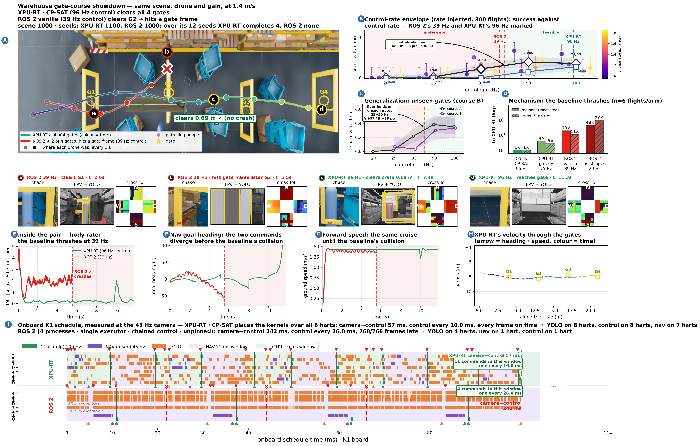

# showdown_45hz_pinned_vs_rosdefault_s1000

ROS 2 as it is normally written -- unpinned, one process per node, default executor -- against a hand-pinned CP-SAT schedule. The baseline's chain is 242 ms and 99.2 % of its frames are late.

> **Read this first.** Label it 'ROS 2, default deployment'. It is the representative default, not the best ROS 2 can do, and the pinned arms are measured separately.



Full size: [`showdown_45hz_pinned_vs_rosdefault_s1000.png`](../../../../results/codesign_feedback/refined/showdown_45hz_pinned_vs_rosdefault_s1000.png) · [`.pdf`](../../../../results/codesign_feedback/refined/showdown_45hz_pinned_vs_rosdefault_s1000.pdf) · sidecar `metrics.json` in this directory.

## The two arms

| | arm | camera→control | control rate | census (completed/12, mean gates) |
|---|---|---|---|---|
| XPU-RT | `acpsat_hardr` via `xpu_a_cpsat_hard.csv` | 56.8 ms | 100 Hz | 4/12, 2.58 |
| ROS 2 | `('vanilla4', 45)` via `ros_vanilla445.csv` | 242 ms | 38 Hz | 0/12, 1.08 |

## What the board measured (panel I)

| row | camera→control | frames late |
|---|---|---|
| `xpu` | 56.86 ms | 0/44 |
| `ros` | 242.097 ms | 760/766 |

## Rebuilding it

```bash
bash reproduce.sh          # from this directory
```

That renders from data already in the repository and the archives — no board, no GPU. The
board runs and the flights behind it need hardware; the reproduction page below carries them.

## Where everything came from

| what | where |
|---|---|
| XPU-RT flight | `results/codesign_feedback/campaign_v2/display_v3s_c1.4/xpu_s1000_figdata` |
| ROS 2 flight | `results/codesign_feedback/campaign_v2/display_v3s_c1.4/ros_s1000_figdata` |
| scene census | `results/codesign_feedback/campaign_scene/tall1000s` |
| panel D energy runs | `results/codesign_feedback/flight_energy_v2.csv` |
| panel I Gantt | `schedules/measured_gantt_v3_xpu_metrics.json` |
| panel I Gantt | `schedules/measured_gantt_v3_ros_metrics.json` |
| full reproduction page | [`docs/Evaluation/showdown_cam45_ros_unpinned_reproduction.md`](../../../../docs/Evaluation/showdown_cam45_ros_unpinned_reproduction.md) |

Small data is copied into `data/` here; the display dumps are 80–300 MB each and stay in
`archive_v3/` with their sha256 in the tracked manifest.

