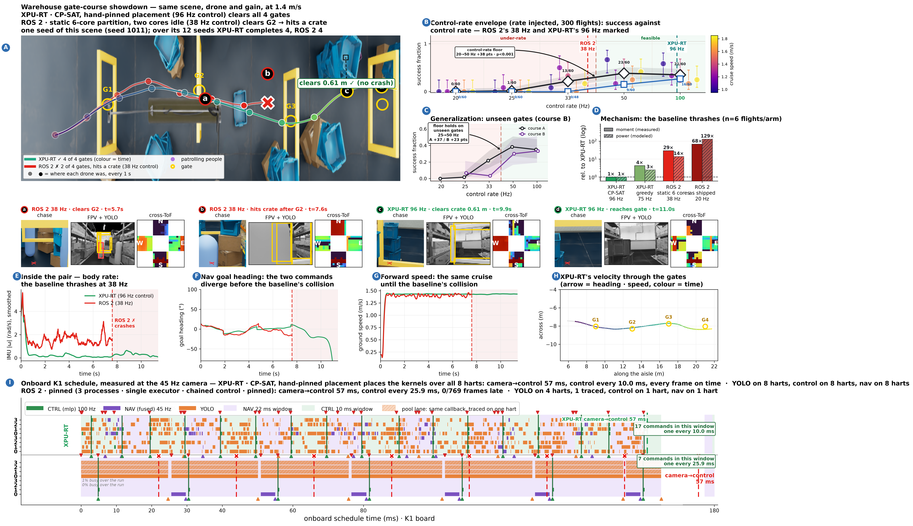

# showdown_45hz_pinned_vs_rospinned_s1011

The falsification test. A statically partitioned ROS 2 -- three pinned processes, YOLO on its own four harts -- against a hand-pinned CP-SAT schedule at the same 57 ms chain, so command rate is the only difference left.

> **Read this first.** This is a TIE and must never be captioned as a win: 4/12 completions each, and the baseline's mean gate count is higher (2.83 against 2.75). It bounds the claim.



Full size: [`showdown_45hz_pinned_vs_rospinned_s1011.png`](../../../../results/codesign_feedback/refined/showdown_45hz_pinned_vs_rospinned_s1011.png) · [`.pdf`](../../../../results/codesign_feedback/refined/showdown_45hz_pinned_vs_rospinned_s1011.pdf) · sidecar `metrics.json` in this directory.

## The two arms

| | arm | camera→control | control rate | census (completed/12, mean gates) |
|---|---|---|---|---|
| XPU-RT | `acpsat_hardr` via `xpu_a_cpsat_hard.csv` | 56.8 ms | 100 Hz | 4/12, 2.75 |
| ROS 2 | `45_cp3_r1` via `ros_cp345.csv` | 56.2 ms | 38 Hz | 4/12, 2.83 |

## What the board measured (panel I)

| row | camera→control | frames late |
|---|---|---|
| `xpu` | 56.86 ms | 0/44 |
| `p3` | 56.757 ms | 0/769 |

## Rebuilding it

```bash
bash reproduce.sh          # from this directory
```

That renders from data already in the repository and the archives — no board, no GPU. The
board runs and the flights behind it need hardware; the reproduction page below carries them.

## Where everything came from

| what | where |
|---|---|
| XPU-RT flight | `results/codesign_feedback/campaign_static6_45/display/search_c1.4/xpu_s1011_figdata` |
| ROS 2 flight | `results/codesign_feedback/campaign_static6_45/display/search_c1.4/ros_s1011_figdata` |
| scene census | `results/codesign_feedback/campaign_scene/static6_45_l1011` |
| panel D energy runs | `results/codesign_feedback/flight_energy_static6_45.csv` |
| panel I Gantt | `results/codesign_feedback/refined/static6_45b/measured_gantt_static6_45b_xpu_metrics.json` |
| panel I Gantt | `results/codesign_feedback/refined/static6_45b/measured_gantt_static6_45b_p3_metrics.json` |
| full reproduction page | [`docs/Evaluation/showdown_cam45_static6_reproduction.md`](../../../../docs/Evaluation/showdown_cam45_static6_reproduction.md) |

Small data is copied into `data/` here; the display dumps are 80–300 MB each and stay in
`archive_v3/` with their sha256 in the tracked manifest.

