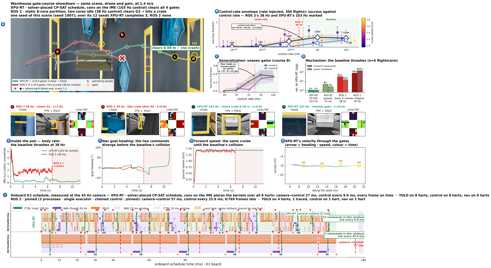

# showdown_45hz_solver_vs_rospinned_s1007

The same partitioned baseline against a schedule whose placement the solver chose rather than a person. The gap the tie at s1011 closes, reopens.

> **Read this first.** Both arms meet their perception window on every frame; the separation is command rate on top of a 2.1x shorter chain.



Full size: [`showdown_45hz_solver_vs_rospinned_s1007.png`](../../../../results/codesign_feedback/refined/showdown_45hz_solver_vs_rospinned_s1007.png) · [`.pdf`](../../../../results/codesign_feedback/refined/showdown_45hz_solver_vs_rospinned_s1007.pdf) · sidecar `metrics.json` in this directory.

## The two arms

| | arm | camera→control | control rate | census (completed/12, mean gates) |
|---|---|---|---|---|
| XPU-RT | `p45freer` via `xpu_p45free.csv` | 27.46 ms | 101 Hz | 3/12, 2.5 |
| ROS 2 | `45_cp3_r1` via `ros_cp345.csv` | 56.2 ms | 38 Hz | 0/12, 1.92 |

## What the board measured (panel I)

| row | camera→control | frames late |
|---|---|---|
| `xpu` | 27.454 ms | 0/21 |
| `p3` | 56.757 ms | 0/769 |

## Rebuilding it

```bash
bash reproduce.sh          # from this directory
```

That renders from data already in the repository and the archives — no board, no GPU. The
board runs and the flights behind it need hardware; the reproduction page below carries them.

## Where everything came from

| what | where |
|---|---|
| XPU-RT flight | `results/codesign_feedback/campaign_free45/display/search_c1.4/xpu_s1007_figdata` |
| ROS 2 flight | `results/codesign_feedback/campaign_free45/display/search_c1.4/ros_s1007_figdata` |
| scene census | `results/codesign_feedback/campaign_scene/free45_l1007` |
| panel D energy runs | `results/codesign_feedback/flight_energy_free45.csv` |
| panel I Gantt | `results/codesign_feedback/refined/free45b/measured_gantt_free45b_xpu_metrics.json` |
| panel I Gantt | `results/codesign_feedback/refined/free45b/measured_gantt_free45b_p3_metrics.json` |
| full reproduction page | [`docs/Evaluation/showdown_cam45_solver_placed_reproduction.md`](../../../../docs/Evaluation/showdown_cam45_solver_placed_reproduction.md) |

Small data is copied into `data/` here; the display dumps are 80–300 MB each and stay in
`archive_v3/` with their sha256 in the tracked manifest.

