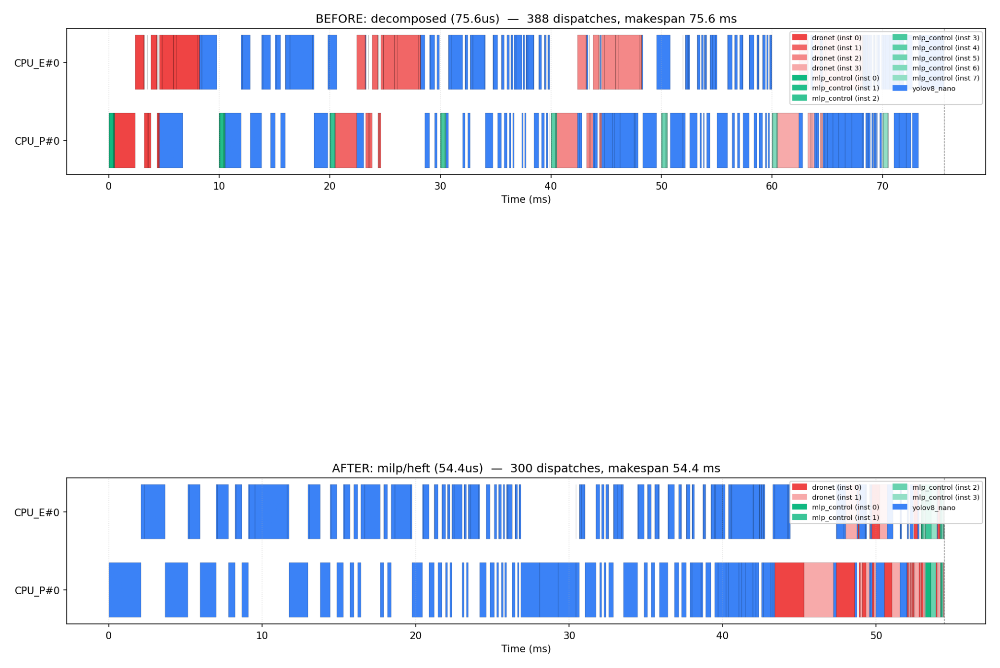

# Iterative scheduling improvement

Deadline budget: **65.0 us** (auto (midpoint best..baseline)).

| id | config | axis | profile_hw | makespan_us | meets | granularity | bottleneck |
|----|--------|------|-----------|------------:|:-----:|-------------|-----------|
| A2 🏆 | milp/heft | scheduler | V256D128_rvv+gemmini_q31 | 54.43 | ✅ | too_fine | CPU_P#0 |
| A3 | milp/peft | scheduler | V256D128_rvv+gemmini_q31 | 56.24 | ✅ | too_fine | CPU_P#0 |
| A1 | greedy | scheduler | V256D128_rvv+gemmini_q31 | 60.48 | ✅ | too_fine | CPU_P#0 |
| baseline | decomposed | baseline | V256D128_rvv+gemmini_q31 | 75.57 | ⚠️ | too_fine | CPU_E#0 |
| B3 | decomposed | backend | V256D128_rvv+gemmini_q31 | 75.57 | ⚠️ | too_fine | CPU_P#0 |
| A4 | milp/edf | scheduler | V256D128_rvv+gemmini_q31 | 116.78 | ⚠️ | too_fine | CPU_E#0 |

Skipped (did not finish within the per-candidate budget):
- `B1` decomposed on V256D128_rvv — timeout (rvv emits many more dispatches — a fusion/coarsen candidate)
- `B2` decomposed on gemmini_q31 — timeout

**Winner: `A2` (milp/heft)** — makespan 54.43 us vs baseline 75.57 us (**28.0% lower**); now meets within the deadline.

## Advisor on baseline

```
Scheduler advisor — solver=decomposed
Deadline: MISSED by 10.6 us (16.3%)   (makespan 75.6 us, deadline 65.0 us)

Diagnosis:
  • Bottleneck backend: CPU_E#0; idle: none.
  • Granularity: too_fine.
  • deadline_miss_count=0.

Recommendations (ordered by expected impact):
  1. [coarsen] fusion_threshold = 1000 cycles
      why: 388/388 dispatches (100.0%) fall below 1000 cycles. Fusing them collapses the dispatch-overhead tail.
```

## Profiler/backend comparison (axis B)

- **cpu_e=V256D128_rvv, cpu_p=gemmini_q31**: best makespan 54.43 us (milp/heft, meets).
- **cpu_e=gemmini_q31, cpu_p=V256D128_rvv**: best makespan 75.57 us (decomposed, misses).
- _Homogeneous backends (V256D128_rvv, gemmini_q31) exceeded the predicted scheduling budget (dispatch-count explosion) — compare them on the real FireSim batch, and/or apply axis-C fusion first._

## Granularity/fusion (axis C — ModelBlaster)

Advisor flagged `too_fine`. Emitted fusion hints for 3 network(s): mlp_control (1 groups), dronet (2 groups), yolov8_nano (6 groups).
See `firesim_batch.json` candidate `C1` for the hint payload; ModelBlaster realizes it (re-extract/re-gen kernels on spike, re-profile on FireSim).

## Before/after Gantt

  
`artifacts/iterate/before_after_gantt.png`

## Next: FireSim batch

`firesim_batch.json` lists 8 candidates for the ModelBlaster session to build + run in one batched FireSim session (see docs/iterative_firesim_loop.md).
