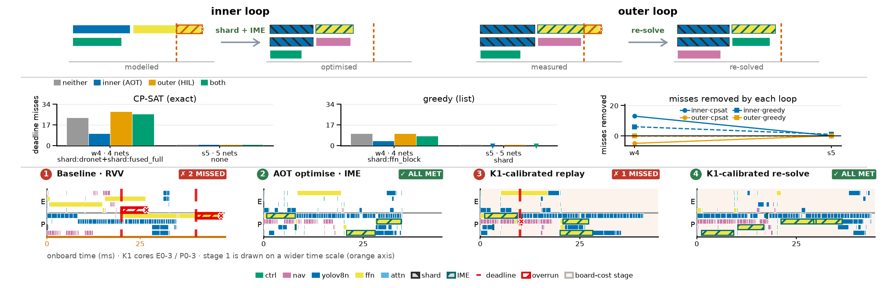

# The co-design feedback loop: a reference for writing it up

A reference for describing the feedback loop: what it does, how it is measured, and what the
measurements support. Every number here is from an artifact in this repo; where a number is
uncertain, or a simpler reading of it does not hold, the page says so.

Contents: what the study asks · methodology · the inner loop · the outer loop · how it
interacts with ModelBlaster · platform and workloads · results · what can and cannot be
claimed · threats to validity.

---

## 1. What the study asks

A robotic workload is several neural networks that must each finish inside a repeating
time window on one heterogeneous SoC. Two questions decide whether it can be deployed:

* **Which compiler transformation should be applied?** Widen a network across cores, move
  its matrix work to an accelerator, split or fuse its graph. This is a *compiler*
  decision but its payoff is only visible in a *schedule*.
* **Is the answer still right on real silicon?** Offline decisions rest on per-operator
  profiles. If the board is slower than the profile, a schedule that met every deadline
  in prediction can miss on hardware.

The system closes a loop for each. The **inner loop** decides transformations offline
against predicted costs. The **outer loop** executes the result on the board and returns
measurements. The study measures what each contributes, separately and together.

---

## 1b. The figure



`results/codesign_feedback/loop_overview.{png,pdf}`, generated by
`scripts/plot_loop_overview.py`, with every number on it repeated in a
`_metrics.json` sidecar. 183 x 58.5 mm — a quarter page at double-column width.

* **Band A** — what the two loops *are*, as schematic before/after Gantts. The inner loop
  fits a modelled overrun by sharding and routing to IME; the outer loop fits a *measured*
  overrun by re-solving against board costs. Schematic, not data.
* **Band B** — the 2x2 ablation, one panel per solver, with the lever the search accepted
  printed on each tick because it is the explanatory variable.
* **Band C** — one solved schedule per stage for a real K1 taskset, with the
  MISSED / ALL MET badges.

Two things to know before using it:

* **Band B currently carries two rungs** (w4 and s5), which is thin. It is the only
  ablation summary produced after the acceptance-rule corrections, and the earlier
  four-rung summaries predate them, so mixing the two would put pre- and post-fix numbers
  in one panel. Adding rungs is a matter of solver time, not of method.
* **Band C is the sensor arc** (2 → 0 → 1 → 0), chosen because it is the arc that returns
  to ALL MET. Its transformation is IME, not sharding — every one of its 217 dispatches is
  width 1 in all four stages. A sharded alternative exists,
  `loop_overview_s5.png` (1 → 0 → 6 → 2), where the sharding is visible in the schedules
  and the re-solve visibly re-shards, but it ends with two misses rather than all met. The
  two cannot currently be had in one arc, for a reason worth stating rather than hiding:
  see §7.2.

---

## 2. Methodology

### 2.1 The experimental design

The two loops are separable, so they are ablated as a 2x2. Each workload is solved four
ways:

| cell | inner loop | outer loop | what it isolates |
|---|---|---|---|
| **A** | off | off | the baseline a competent solver produces unaided |
| **B** | on | off | what offline co-design contributes |
| **C** | off | on | what measurement contributes without changing the graph |
| **D** | on | on | whether the two compose or interfere |

Every cell is run under **both** schedulers -- CP-SAT and the greedy list scheduler --
because a result that only holds for one solver is a property of that solver, not of the
loop. Reporting both is also what exposes when a solver, rather than the method, is the
limiting factor.

### 2.2 What is held constant

* **The same profile database** feeds every cell of a rung, so cells differ only in what
  the scheduler was told and which transformations it was allowed.
* **Compaction is forced off** (`XPURT_NO_COMPACT=1`). It is a post-pass that left-shifts
  a schedule: idempotent on tight solvers, slack-eliminating on list schedulers, and the
  greedy family bypasses the registry so it would never receive the pass at all. Left on,
  it systematically narrows the gap between arms -- it changes *which arm wins*, not just
  the numbers.
* **CP-SAT worker count is pinned and recorded**, since parallel search under a wall-clock
  limit is nondeterministic.
* **The codegen contract is applied to every arm**, so no arm is credited with a schedule
  that could not be built.

### 2.3 The metric, and why this one

The headline metric is **instance-level deadline misses**: how many releases of a network
finished after their deadline. Two properties make it the right choice and both matter
under scrutiny:

* It is the quantity the system exists to control. A real-time workload either meets its
  deadlines or does not; makespan is a proxy that can improve while the system gets worse.
* It is **integer and deterministic** given a schedule and a cost model, so a difference
  of one is real rather than noise.

There is a second, coarser counter in the codebase -- *dispatch*-level misses -- and the
two do not agree, because one late dispatch does not necessarily make its instance late.
Every number in this document is instance-level unless it says otherwise. Mixing them is
the single easiest way to produce an inconsistent table.

Secondary metrics: worst-case deadline lateness (how badly, not just how often), makespan,
and for the outer loop the ratio of measured to predicted per-dispatch time, which is how
we establish that the planner's model of the machine is sound rather than merely
self-consistent.

### 2.4 Reproducibility and provenance

* **Determinism is checked, not assumed.** Two independent end-to-end runs of the same
  rung are bit-identical, makespan to three decimals. Where a solve *is* nondeterministic
  (CP-SAT above one worker under a time limit) the run is repeated and the spread is
  reported rather than a single draw.
* **Every solved schedule carries a solver certificate** recording, per lexicographic
  phase, the status (`OPTIMAL` / `FEASIBLE`), the objective, the best bound and the wall
  time. This is what lets us distinguish "the solver proved this is the best schedule"
  from "the solver ran out of time" -- a distinction that turns out to explain most of the
  variation in the results (§7.3).
* **Profiles are provenance-tagged.** A profile row records whether it came from the board
  (`source=k1`) or elsewhere, so a measured number cannot be quietly substituted by an
  estimate.
* **Board calibrations are per-workload and regenerable.** Each is emitted from the trace
  of the run it describes, records which networks it measured, and names its own
  fallbacks -- so a reader can tell measurement from extrapolation without inspecting the
  code.

### 2.5 How a workload is admitted to the study

A rung is only informative if it sits in a narrow band: the baseline must miss at least
one deadline (otherwise nothing is at stake and every cell reads zero), and a schedule
meeting every deadline must exist using implementations already measured on the board
(otherwise a failure is the compiler's or the hardware's, not the loop's).

Both conditions are established **empirically, by solving**, not analytically. That is a
deliberate choice: closed-form tests of "can the baseline meet this" are easy to write and
easy to get wrong, because they must model what the scheduler is free to do -- spread one
network's instances across harts, parallelise one instance's dispatches across cores, or
widen a dispatch. Solving the baseline and looking is the only test that cannot be wrong
about the scheduler's own freedom. The admission check is
`scripts/make_scaling_workloads.py --check` for the static conditions, plus a
solve-and-measure sweep for reachability.

---

## 3. The inner loop, in detail

Offline. No hardware in the path, so it is bounded by compile and profile time.

### 3.0 The algorithm

```
design <- baseline spec
schedule <- SOLVE(design);  score <- EVALUATE(schedule)
repeat until no candidate is accepted, or round budget exhausted:
    candidates <- []
    for each lever L not already applied:
        cand <- APPLY(L, design)                  # spec edit, or a real IR rewrite
        if cand == design: continue               # a no-op lever is not a candidate
        cand_sched <- SOLVE(cand)                 # the real solver, not an estimate
        if not BUILDABLE(cand_sched): continue    # codegen contract, before performance
        verdict <- ACCEPT(EVALUATE(cand_sched), score)   # nine terms, lexicographic
        candidates.append((L, cand, cand_sched, verdict))
    winners <- [c for c in candidates if c.verdict is accept]
    if winners is empty: converged
    best <- argmin over winners of (misses, worst_lateness, freq_shortfall, p99, makespan)
    design, schedule, score <- best
```

Four properties of this loop are worth defending explicitly, because each is a choice a
reviewer can reasonably question:

* **Best-improvement, not first-improvement.** All applicable levers are evaluated each
  round and the best is taken. First-improvement is cheaper but path-dependent: it commits
  to whichever lever happens to be tried first, and on one rung that meant accepting a
  lever which improved a tertiary term while leaving all ten deadline misses in place,
  after which the lever that would have halved them was never reached.
* **A no-op lever is skipped rather than scored.** If applying a lever leaves the spec
  unchanged, re-solving the identical spec can still return a different schedule under a
  nondeterministic solver, and the loop would then credit the lever with the difference.
  This actually happened before the guard existed.
* **Buildability is checked before performance**, so the search cannot be led by a
  schedule that could never be deployed.
* **The winner is ranked by the same criteria that accepted it.** Ranking by a single
  scalar (makespan, say) can pick a candidate that is worse on the term the rule considers
  most important.

### 3.1 Candidate generation

Each round proposes one *candidate design* per available lever, applied on top of the
current design:

| lever | what it changes | how |
|---|---|---|
| `shard:<net>` | widens ONE network across harts, holding the others at one core | spec: `machine_combination_mode: shard` plus `scheduler.shard_only_networks` |
| `shard` | widens every network at once | spec, global |
| `ime` | allows matrix dispatches on the K1's IME engine | spec: `enable_impls` |
| `unfuse` | points a network at ModelBlaster's unfused dispatch graph | swaps `dispatch_deps_path` |
| rewrite verbs | genuinely edits the IR — fuse / split | ModelBlaster rewrite arm; regenerated, host-verified bit-exact, re-profiled |

`shard` being **per network** matters. It began as one global switch, which forced the
loop to widen everything or nothing. On the five-network rung that made the lever
unusable: widening also widened YOLO — 191.6 core-ms that monopolises all eight harts
while the 5 ms-period networks wait — so worst-case lateness went 24.67 → 34.87 ms and
the whole lever was rejected, including the part that helped. Per-network candidates
compose across rounds, so the loop *discovers* the set `{ffn_block, dronet}` rather than
guessing it.

### 3.2 Evaluation: candidates are solved, not estimated

Every candidate is scheduled by the real solver (CP-SAT or the greedy list scheduler) and
scored on the resulting timeline. Nothing is judged by a cost proxy.

### 3.3 The acceptance rule

`xpu-rt/candidate_objective.py:accept()`. Nine terms, strict lexicographic order:

1. hard deadline misses  2. max deadline lateness  3. frequency compliance
4. p99 response of critical tasks  5. heavy-model max latency  6. heavy-model throughput
7. **makespan**  8. utilisation  9. standalone kernel cycles

Deadline misses first, makespan **seventh** — a candidate that finishes sooner but misses
one more deadline loses. The comparison walks the terms in order and stops at the first
one where the two candidates differ by more than that term's tolerance; **a tie on every
term is a rejection**, because a transformation that cannot be shown to help is not worth
the rebuild, the regenerated kernels, or the loss of a known-good baseline.

Why lexicographic rather than a weighted sum: weights would let a large makespan gain buy
a deadline miss, which is exactly the trade a real-time system must not make. It also
makes the rule auditable — for any decision, one term is *the* reason, and the loop
records which.

The tolerances exist because each quantity was observed to move on its own between
identical runs, and a tolerance must exceed the observed noise to absorb it:

| term | tolerance | basis |
|---|---|---|
| deadline misses | 1 instance, or 8% of instances released | seven repeats of one board schedule gave 7–9 misses of 38 (a spread of 2, i.e. 5.3%), so 5% would not have covered it |
| max lateness | 0.5 ms | |
| frequency compliance | 2% | |
| p99 response | 0.5 ms | |
| heavy-model latency | 1.0 ms | |
| heavy-model throughput | 2% | |
| makespan | 2% | stable to ~1% across repeated identical runs |
| utilisation | 2 pp | |
| standalone kernel cycles | 1% | |

One refinement matters for correctness of the comparison. Those tolerances are calibrated
on *measured board* runs, where execution jitter is real. Inside the offline search, a
candidate's miss count is computed from a solved schedule against fixed costs — a
deterministic function with no run-to-run spread, which we verified: two independent
end-to-end runs are bit-identical. Applying a measurement tolerance there would discard
genuine integer improvements (on a 34-instance rung, 8% is 2.72 misses, enough to call a
5 → 3 improvement a tie). The offline comparison therefore uses a zero tolerance on the
integer term and keeps the tolerances on the continuous ones, which really do move between
identical CP-SAT runs under a time limit. Provenance decides which tolerance applies.

Two defects here were costing a lever each, and both are worth a sentence in the paper
because they are easy for a reader to suspect:

* **A measurement tolerance was applied to a deterministic count.** `miss_rate_frac` is 8%
  because seven repeated *board runs* of one schedule gave 7–9 misses of 38 — real
  execution jitter. But in the AOT search a candidate's misses are computed from a solved
  schedule against fixed costs: deterministic, with no run-to-run spread (two independent
  full loop runs are bit-identical). Applied there it cost exactly the improvements the
  loop exists to find — on one rung, 8% of 34 instances is 2.72 misses, so a candidate
  taking misses 5 → 3 was reported "indistinguishable on every term". Fixed with
  `DETERMINISTIC_TOLERANCES`, which zeroes the miss tolerance and keeps the continuous
  ones (lateness, p99, makespan do move between identical CP-SAT runs under a time limit).
* **The winner among accepted candidates was ranked by makespan**, the seventh term, while
  the comment claimed it minimised "the objective". Fixing the tolerance exposed it: with
  more candidates accepted per round, one rung's final went from 7 misses to 9. Ranking
  now mirrors the nine-term order.

### 3.4 The buildability veto

Before performance is considered, `xpu-rt/codegen_contract.py:violations()` rejects
candidates the code generator cannot build. This is the part of the design that makes the
loop's output *deployable* rather than merely optimal on paper, and it is worth stating
plainly: the scheduler is free to propose anything, and a single declarative file --
`ModelBlaster/cores/codegen_contract.json`, owned by the compiler and consumed by the
scheduler -- decides what can actually be generated. Seven rules, six of them refusals:

| rule | what it forbids | why the compiler cannot do it |
|---|---|---|
| `uniform_width_across_instances` | one dispatch at two different core widths across its periodic instances | the packed weight array is emitted per shard at skeleton-generation time, so one model cannot carry two layouts |
| `width_divides_output_channels` | a shard count that does not divide OC | each shard takes its own OC slice; a remainder has nowhere to go |
| `linear_split_axis` | an N-split when M > 1 | the N-split aliases one output tile per shard into a single buffer at `off_m*N`; with M > 1 the tiles overlap |
| `ime` | an IME dispatch on harts 4–7 | `smt.vmadot` executes on harts 0–3 and **traps** on 4–7, established by a per-core SIGILL probe — a correctness rule, not a performance one |
| `machine_combinations` | a combination mixing core kinds | `kind` is how the runtime resolves an abstract slot to a hart |
| `staged_ir_networks` | scheduling a network whose IR is not staged | nothing to generate from |
| `runtime_sliceable_ops` | (advisory, severity `none`) | row-major weights are sliced at runtime from the pool width, so nothing is baked at generation time |

Having this as data rather than as scattered checks is what lets the same rules bind two
very different schedulers, and lets a violation be *reported* with the offending network,
dispatch and op rather than surfacing as a build failure hours later.

#### 3.5 Making the contract binding on both schedulers

An exact solver and a list scheduler have to be held to the contract in different ways,
and this is the most subtle mechanism in the loop.

CP-SAT has a combination-selection variable per dispatch, so uniform width can be
expressed *as a constraint*: for each packed-weight dispatch, one boolean per usable width,
coupled to every instance's selection, with exactly one width chosen. The solver then picks
the width, and the contract is satisfied by construction. Crucially it is encoded as a
per-(dispatch, width) indicator rather than by pinning a width, so the *choice* stays with
the solver -- the right width depends on what else is running.

A list scheduler has nothing to couple: it picks each dispatch's combination greedily as it
walks the ready set. So for that arm the contract could only ever be checked afterwards and
the whole candidate discarded -- which understates the list scheduler on exactly the
workloads where sharding is the answer. On one rung its shard candidate (5 misses against
the baseline's 10, worst lateness 3.09 ms against 17.95) was thrown away over **three**
dronet dispatches.

The fix makes the contract binding *by construction* for both: each packed-weight dispatch
is restricted to one width up front, so no schedule can violate the rule regardless of how
the scheduler chooses. Two mechanics matter:

* **The width is chosen by measured cost**, minimising the summed duration over the
  dispatch's instances among the widths every instance can take. Two simpler policies are
  both wrong on real data: "widest" loses, because YOLO's OC=2 detect-head convolutions
  measure *slower* on four cores than on one; "narrowest" silently undoes the sharding the
  lever exists to apply.
* **The excluded widths are priced out, not flagged.** The two schedulers consult
  different things: the list scheduler selects purely on completion time and never reads
  the infeasibility set at all, so marking a combination infeasible does not stop it from
  being chosen. `processing_times` is what *both* read (`get_duration_for_combination` is
  a direct index into it), and CP-SAT independently folds a prohibitive cost back into its
  own exclusions, so writing one sentinel cost binds both arms with one edit.

One consequence is worth recording because it is counter-intuitive and cost real solver
time: **a warm start that violates a constraint is worse than no warm start.** CP-SAT is
seeded from a HEFT schedule, which is computed before these exclusions exist and therefore
hints combinations that are subsequently illegal. The solver does not merely ignore such a
hint -- it begins from an infeasible point and spends its budget repairing it. On one rung
that returned *no schedule at all* after 400 s, where the unconstrained solve of the same
spec succeeded. The hint is now projected onto the constraints before being handed over:
per coupled dispatch, the width HEFT chose most often among that dispatch's instances
(restricted to widths every instance can take), and any hinted combination that is
excluded for any reason is replaced by the cheapest legal one. Seeding from the greedy
schedule instead is a documented dead end -- its combination indexing differs, so its
hints mislead rather than help.

### 3.6 Convergence

The accepted candidate becomes the base for the next round, so transformations compose.
The loop stops when a round accepts nothing.

---

## 4. The outer loop, in detail

### 4.1 Execute the schedule on the board

What distinguishes this from a simulation study is that the *scheduler's own artefact* is
what executes. `ModelBlaster/scripts/run_xpurt_k1.sh` takes the solved schedule and, per
network, extracts or accepts staged IR, generates the skeleton and kernels, ingests the
schedule into a `dispatch_table.{c,h}`, generates an `xpurt_main.c` walker for the target
platform, cross-builds a RISC-V binary, deploys it, runs it with threads pinned to the
harts the schedule assigned, and pulls back stdout and a trace CSV.

Three properties make the returned numbers usable as evidence rather than as an anecdote:

* **The generated C *is* the executable.** An earlier runner executed IREE VMFBs, which
  meant every measurement went through the IREE path and ModelBlaster's own generated
  kernels were never what the scheduler placed -- and a rewritten graph has no VMFB, so
  granularity changes were unmeasurable. Here a graph rewrite is directly runnable.
* **Numerics are checked on every run.** Each network's output is compared against a
  reference: the int8 networks return bit-exact (`max_abs_err=0`, e.g. `ffn_block` over
  n=32768 and `yolov8_nano_64x96` over n=8316), the float `fused_full` within 1.8e-4. A
  timing measurement from a run that computed the wrong answer is discarded.
* **The placement is enforced, not hoped for.** Threads are pinned to the assigned harts
  and the pool widths are reported per block, so the thing measured is the schedule that
  was solved.

Practical notes that cost time to rediscover:

* `--backends` takes one entry per **core kind**, not per model — two on the K1 regardless
  of how many networks are in the schedule.
* Graph extraction needs torch, which the solver venv lacks, so board runs reuse built IR
  via `--staged-ir <net>:<dir>` rather than re-extracting. The build tree is
  `ModelBlaster/build/k1_xpurt/`, not `build/`.
* A schedule using the `ime` lever needs an `ime_x60` backend; an RVV-only build dies with
  `FATAL entry 0 of ffn_block asks for impl 'ime'`.

The trace carries, per dispatch: network, instance, dispatch id, op, core kind, hart,
predicted start and duration, and **actual start and end in rdtime cycles** (24 MHz).

### 4.2 Turn the trace into costs

`scripts/emit_board_calibration.py` reduces the trace to a cost correction. For each
dispatch it computes

```
multiplier = actual / predicted
  actual    = (actual_end_cycles - actual_start_cycles) / 24 MHz    # rdtime ticks
  predicted = predicted_duration_ms                                 # stamped by the runner
```

Both come from the trace itself, so calibrating a new workload needs no schedule file, no
IR and no join. The per-dispatch multipliers are then aggregated into three tiers,
matching the lookup order in `profile_loader._board_calibration_mult`:

1. `per_dispatch_multiplier["net/dispatch_id"]` — exact, measured
2. `per_op_multiplier["op_kind"]` — pooled fallback
3. `aggregate_multiplier` — last resort

The statistic is the arithmetic mean of per-sample ratios, with a floor on the pooled
op-kind tier (default 0.1 ms = 2400 ticks). The floor is necessary because mean-of-ratios
is outlier-sensitive and a dispatch of a few hundred ticks can show an 18x ratio purely
from timer granularity; the per-dispatch tier keeps every sample, because there the
samples are the same code on the same core and are directly comparable. A median variant
is available and is the more robust statistic; it is not the default only because it would
silently move every existing outer-loop number.

Three design choices to state if the paper describes this:

* **Execution only; queueing excluded.** A dispatch that waited is not a dispatch that ran
  slowly, and folding queueing into a per-op cost would charge the scheduler twice for its
  own placement decisions.
* **Dispatch-id alignment is checked** against the schedule rather than assumed. The
  runner records zero-cost ops (`chunk`, `split`, `slice`) with id `-1` and numbers the
  remaining dispatches from zero, while the schedule numbers every dispatch including
  those -- so on a network containing zero-cost ops the two numberings diverge after the
  first one, and YOLO's trace carries ids the schedule does not have. Unchecked, this
  would file a network's measurements under keys no consumer looks up: the calibration
  would silently cover four of five networks while *holding* the fifth's measurements the
  whole time. Where the numberings diverge, per-dispatch keys are dropped for that network
  and it falls back to op-kind keys, which are keyed by the row's own op and so remain
  measured rather than extrapolated.
* **Coverage is declared.** Each calibration names the networks it measured exactly, the
  number of exact keys, and its fallback policy, so a consumer can distinguish measurement
  from extrapolation without reading the code.

This tool also closed a provenance gap: the deployed calibration table was an **orphaned
output** — the script that produced it was never committed, so it could be used but not
regenerated for a new workload, and its own metadata admitted YOLO was extrapolated.

### 4.3 Re-cost: the reveal

Re-scoring the **same** schedule on measured costs is the step that carries information,
because it separates *the model was optimistic* from *the schedule was wrong*. On one
five-network rung the offline model predicted 7 misses and the board showed **16** —
including five in a network the offline solve believed was entirely fine.

### 4.4 Feed back, at two depths

* **Re-solve**: the scheduler re-places dispatches against measured costs.
* **Re-search**: the lever search itself runs against measured costs, so the *choice* of
  transformation is made on measured rather than predicted data (`--search-calibration`).

### 4.5 Attribute the residual

A miss count says how many deadlines were missed, never whether a better schedule existed.
Two very different situations produce one, and conflating them is how a scheduling study
ends up blaming the scheduler for a compiler gap. `scripts/attribute_board_misses.py`
separates them from the trace's own cycles:

```
execution(instance) = SUM over its dispatches of (actual_end - actual_start) / 24 MHz
  execution > window  ->  EXECUTION-BOUND: no placement can fix it
  otherwise           ->  QUEUEING: the instance waited, which IS the scheduler's to fix
```

Summing execution deliberately ignores *when* the dispatches ran, which is exactly the
quantity a scheduler cannot change. A further distinction is drawn within the
execution-bound set:

* **cold start** — the *first* instance is over window but the warm median is not. A
  network's first instance runs up to 2.74× its warm median (measured: `fused_full`
  11.7 ms against 4.3 warm; `dronet` 1.34×), and a warm steady-state profile models none
  of it. This is a deployment property — you warm up before the mission — not a scheduling
  failure, and reporting it separately keeps it from being counted as one.
* **structural** — the warm execution itself exceeds the window, so the network cannot
  meet that deadline at that width however it is placed. The remedy is a faster kernel, a
  wider implementation, or a longer window; naming which is more useful to a compiler team
  than a miss count.

This is arguably the outer loop's most useful output: it converts "the loop failed" into
"the target was not achievable, here is why".

---

## 5. How this interacts with ModelBlaster

The scheduler cannot change how fast an operator runs; only the compiler can. So the
interesting half of the loop is the interface between them, and it is deliberately narrow:
the scheduler emits *advice* about what it wishes were true, ModelBlaster decides whether
that is expressible, and only a rewrite that survives verification is allowed back into a
schedule.

### 5.1 The chain

```
solved schedule
   -> emit_advice            scheduler observes what hurt (a dispatch that cannot fit its
                             window at any placement, a fusion that blocks parallelism)
   -> advice_to_*_hint.py    advice becomes a typed hint against a specific IR:
                             shard / split / fusion / unfuse / kernel choice
   -> apply_*_hint.py        ModelBlaster rewrites the IR (apply_shard_hint,
                             apply_split_hint, apply_fusion_hint, apply_unfuse_hint,
                             apply_ime_hint)
   -> generate skeleton + kernels
   -> HOST VERIFY            rewritten model must match the reference bit-exactly
   -> emit_dispatch_graph    the rewritten graph gets its own dispatch identities
   -> re-profile             on the board, under its own basename <net>.<tag>
   -> back into the loop as a candidate, judged like any other
```

Each arrow is a gate, and each rejects something:

* **The hint may be inexpressible.** `advice_to_shard_hint` will only emit for ops that
  are actually shardable, and `apply_split_hint` refuses an N-split when M > 1 because the
  output tiles would overlap. A wish the compiler cannot grant is dropped here, not
  discovered later.
* **The rewrite may be a no-op.** The applier reports whether the graph actually changed
  (`GRAPH_CHANGED` / `GRAPH_UNCHANGED` / `GRAPH_ERROR`). An unchanged graph is not a
  candidate — otherwise re-solving an identical spec under a nondeterministic solver would
  credit the rewrite with the difference.
* **The rewrite must be numerically identical.** `fuse`, `unfuse` and `split` are verified
  against the reference on the host before they are allowed to be scheduled, and again on
  the board at run time. A faster wrong answer is not an optimisation.
* **The rewrite must be re-profiled, not extrapolated.** This is the rule that costs the
  most time and is the most important: a rewritten graph has no profile, and scheduling it
  on costs derived from its parent measures the derivation rather than the rewrite. The
  two arms are profiled in the same session, with the same curated kernels, filed under
  their own basenames (`<net>.<tag>`) — because `gen/mb/profile` is a symlink and the
  profiler writes in place, so a shared basename would let the second run overwrite what
  the first was solved from and the comparison would silently become a schedule against
  itself.

### 5.2 Why the split of responsibility is this way round

The scheduler is the only component that can see *contention* — that widening YOLO starves
the 5 ms-period networks — and the compiler is the only component that knows what is
generable. Neither can make the decision alone:

* A compiler optimising in isolation would shard everything it can, which on this SoC is
  wrong: sharding buys wall time and costs efficiency (`ffn_block` goes 26.61 → 7.72 ms
  from 1 to 8 cores, a 3.45× speedup that consumes 61.8 core-ms instead of 26.61), so past
  a point the core budget will not carry it.
* A scheduler optimising in isolation would place work it cannot get code for. The
  contract file (§3.4) is what prevents that, and it is owned by the compiler.

The loop is the negotiation: the scheduler proposes against real timelines, the compiler
refuses what it cannot build and rewrites what it can, and the accept rule adjudicates on
measured outcomes.

### 5.3 What is automatic today, and what is not

Worth being precise, because "automatic" is exactly the claim a reviewer will test.

* **Fully automatic, no human in the loop**: the scheduling-side decisions — per-network
  shard width, engine routing, and re-solving against measured board costs — plus the
  buildability gate, the accept rule, board execution, calibration and attribution. The
  results in §6 were produced by running one driver.
* **Automatic but gated on tooling**: the graph rewrites. They are applied through the
  compilation flow and verified automatically, but regenerating kernels needs the RISC-V
  cross-toolchain and re-profiling needs the physical board, so a rewrite arm run is a
  build/hardware step rather than a pure scheduling step. Where those are unavailable, the
  loop runs with the spec-level levers only and says so.

---

## 6. Platform and workloads

**SpaceMiT K1**: 8 RVV X60 harts in two clusters (4 "P", 4 "E"), plus the IME matrix
engine on cluster 0 (cluster 1 traps on it). Timing from `rdtime` at 24 MHz.

**Networks**, with measured whole-net board times:

| network | 1 core | best | speedup | dispatches/instance |
|---|---:|---:|---:|---:|
| mlp_control | 0.08 ms | 0.08 (1c) | 1.00× | 7 |
| attn_block | 0.13 | 0.13 (1c) | 1.00× | 14 |
| fused_full | 3.62 | 3.62 (1c) | 1.00× | 15 |
| dronet | 8.33 | 5.25 (4c) | 1.59× | 21 |
| ffn_block | 26.61 | 7.72 (8c) | 3.45× | 5 |
| yolov8_nano_64x96 | 47.73 | 23.95 (8c) | 1.99× | 98 |

**Rungs** are sized so that (a) the baseline misses at least one deadline and (b) a
schedule meeting every deadline exists using implementations already measured on the
board. `scripts/make_scaling_workloads.py --check` reports whether a rung is in that band.

---

## 7. Results

### 7.1 Inner loop

Instance-level deadline misses, greedy, reproducible bit-for-bit across runs:

| rung | networks | baseline → after | levers found |
|---|---:|---|---|
| w2 | 2 | 5 → **0** | `shard` |
| w3 | 3 | 10 → **5** | `shard` |
| w4 | 4 | 10 → **5** (−21.7% makespan) | `shard:ffn_block` |
| w5 | 5 | 11 → **7** (−14.2%) | `shard:ffn_block`, `shard:dronet`, `ime` |
| b4 board-sized | 4 | 10 → **3** | `shard` |
| s5 | 5 | 1 → **0** (−30.4%) | `shard:yolo`, `shard:ffn_block` |

w4 and w5 previously reported 10 → 10 and 11 → 11. Nothing about the scheduler changed;
the four defects in §2.3 and §2.4 were removed.

### 7.2 Outer loop — the four-beat arcs

`baseline → AOT-optimised → board re-cost → board re-solve`, instance misses:

| rung | arc | reading |
|---|---|---|
| c2 (2 nets) | 5 → 0 → 0 → 0 | AOT model accurate; nothing to correct |
| b4 (4 nets) | 10 → 3 → 4 → 4 | board slightly harsher; greedy re-solve made it worse (4 → 8) and was correctly refused |
| b5y (5 nets) | 3 → **0 → 0** → 0 | zero misses that HOLD on hardware; zero execution-bound instances |
| w5 (5 nets) | 11 → 7 → **16** → 14 | the reveal: 9 misses the model did not predict, 5 in a network it thought was clean |
| sensor (5 nets) | 2 → 0 → **1** → 0 | reveal **and** fix — the arc the figure shows |
| **s5** (5 nets) | 1 → 0 → **6** → **2** | reveal AND fix: 6 misses exposed across all five networks, 4 recovered; residual is execution-bound |

Nine board runs were taken, each calibrated from its own trace (aggregate multipliers
1.13–1.73, 109–484 dispatch samples).

**s5 in detail**, because it is the arc where both halves of the outer loop are visible:

| beat | misses | what changed |
|---|---:|---|
| 1 baseline | 1 | 215 dispatches, every one at width 1 |
| 2 AOT optimise | **0** | `shard:yolo` + `shard:ffn_block`; 20 dispatches move to width 2, 49 to width 4; makespan −30.4% |
| 3 board re-cost | **6** | misses appear in *all five* networks, none of them predicted |
| 4 board re-solve | **2** | re-places against measured costs and visibly re-shards (13 at width 2, 56 at width 4), recovering 4 of the 6 |

The residual 2 is execution-bound rather than mis-scheduled: sharded YOLO measures
40.3 ms against its 30 ms window — 1.66× its 24.35 ms profile at four cores — so no
placement recovers it, and the attribution tool says so directly.

One number to be ready for: the measured multipliers on this run span 0.73–14.31 with a
mean of 1.82. The 14× is timer granularity on a sub-0.1 ms dispatch, which is why the
pooled op-kind tier carries a 0.1 ms floor; the per-dispatch tier, where the samples are
the same code on the same core, keeps every sample.

### 7.3 Solver behaviour

From all 204 CP-SAT certificates in the repo (83 OPTIMAL / 121 FEASIBLE):

* **A reachable target is a tractable one.** Every run whose phase-1 objective is 0 is
  OPTIMAL — 55 of 55. All 121 FEASIBLE runs have objective > 0 and an open gap.
* **Size bites at the top.** n=492 dispatches is *never* OPTIMAL (0/33); above 300, only 2
  of 73 ever proved phase 1. At 215 dispatches phase 1 proves optimal in 18–31 s.
* Between those, node count is a weak predictor — n=214 is mostly FEASIBLE while the
  larger n=217 and n=254 are mostly OPTIMAL.

---

## 8. What can and cannot be claimed

**Supported:**

* The inner loop clears or reduces deadline misses on every rung tested, reproducibly, and
  composes multiple transformations (up to three levers over three rounds).
* The loop's decisions are gated by a buildability contract, so what it proposes can
  actually be generated — this is checkable, not asserted.
* The outer loop reveals misses no offline solve can find (7 predicted → 16 measured), and
  attributes residuals into schedulable and unschedulable.
* A five-network workload reaches zero misses that hold under measurement (`b5y`).
* The whole chain runs unattended: propose → solve → verify buildable → execute on
  hardware → calibrate → re-cost → re-solve.
* On at least one five-network workload (**s5**) every stage of that chain visibly
  contributes: the inner loop clears the deadline offline with two composed sharding
  decisions, the board exposes six misses in networks the model thought were clean, and
  the re-solve recovers four of them by re-sharding against measured costs. The two
  remaining are attributed, with measurements, to a network whose execution exceeds its
  window at any placement.

**Not supported, and worth not implying:**

* *That the outer loop's re-solve reliably recovers what it reveals.* It sometimes does
  and sometimes does not, and the honest claim is conditional. On **s5** it recovers 4 of
  6 revealed misses. On **w4, w5 and b5z**, with both solvers, it recovered little or
  nothing — on b5z the minimum over the *entire* shard lever space was 3 misses while the
  blind schedule measured 1, so no re-solve could have helped there. What separates them
  is whether a better schedule exists at all under the measured costs, which is a property
  of the workload rather than of the method. The **reveal-and-attribute** half, by
  contrast, produced information on every rung. Claim the reveal unconditionally; claim
  the recovery with the condition attached.
* *That CP-SAT beats greedy here.* It ties on small rungs and loses on large ones. It is
  the better *re-optimiser* (recovering 9 misses on one re-solve where greedy recovered 2)
  but the worse *solver* at these sizes.
* *That the loop scales smoothly with network count.* The b2y–b5y rungs all report 3 → 0
  with an identical makespan because one network dominates; they are four views of one
  problem, not a scaling curve.

---

## 9. Threats to validity, and how each is handled

Stated here so they can be answered rather than discovered.

**The board is one device.** Every measurement is from a single SpaceMiT K1. Nothing here
establishes cross-device variation, and the multipliers should be described as calibrating
*this* board, not the part.

**Measurements are single runs per schedule, not distributions.** Each arc's board numbers
come from one execution. Repeat variation was characterised separately (seven repeats of
one schedule gave a spread of 2 misses of 38, ~5%) and that figure is what the tolerances
are built on, but per-arc error bars are not claimed. Differences of one instance on the
board should be described as such rather than as robust effects.

**Cold start is present in every board number.** The first instance of a network runs up to
2.74× its warm median. It is measured and reported separately rather than removed, so
board-side totals include a warm-up cost a long-running deployment would amortise.

**The workloads are constructed, not sampled from a fleet.** Rungs are built to sit in the
band where scheduling decides the outcome, because the available specs are bimodal --
many meet every deadline unaided, others ask for something no schedule can deliver. That
is the right design for isolating the loop's contribution, and it does mean the rungs are
not a random sample of deployments. The construction rule is stated and the admission test
is mechanical (§2.5).

**Solver budget is a confound, and is reported rather than hidden.** CP-SAT's behaviour
depends strongly on whether it can prove its top objective, and at the larger model sizes
it cannot within any budget we gave it. Certificates are recorded per phase so a reader can
tell a proven result from a truncated one, and results are reported for both solvers.

**Two miss counters exist.** Instance-level and dispatch-level do not agree. Everything
here is instance-level unless stated; a table mixing them would be inconsistent.

**Some calibration is extrapolated, and says so.** Where a network's per-dispatch keys
cannot be aligned, it falls back to op-kind multipliers measured from its own rows; where a
network is absent from a calibration set entirely, the aggregate applies. Each calibration
declares its own coverage, so this is checkable per run.
