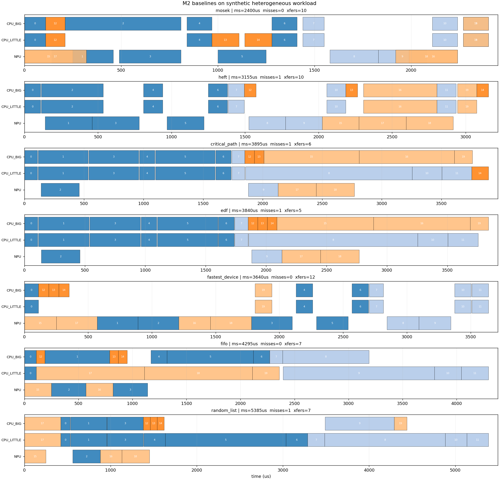
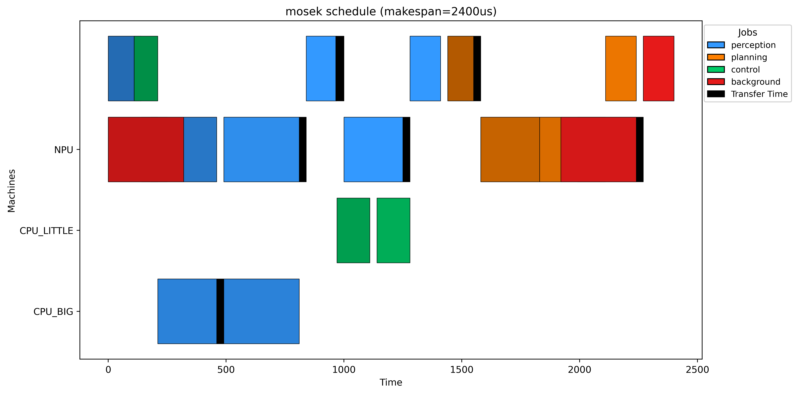
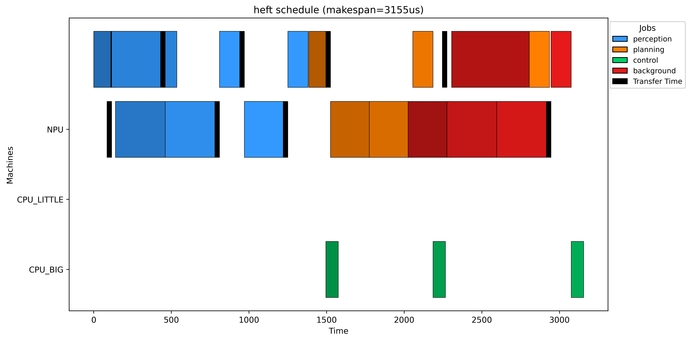
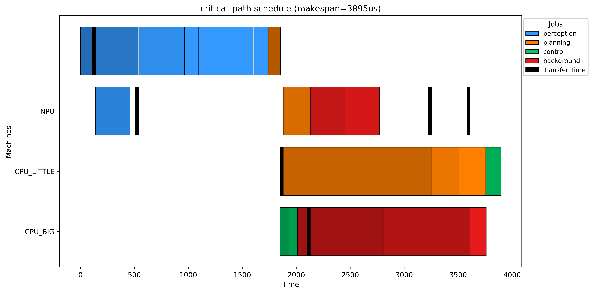
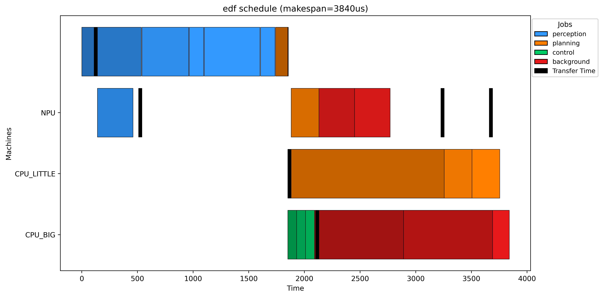
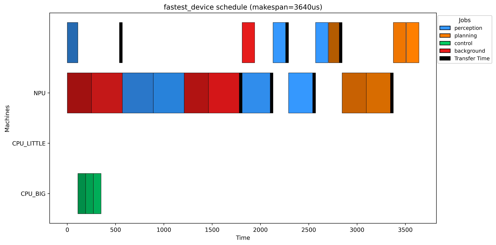
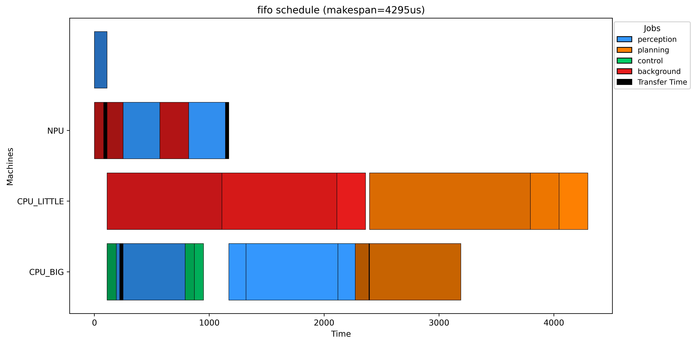
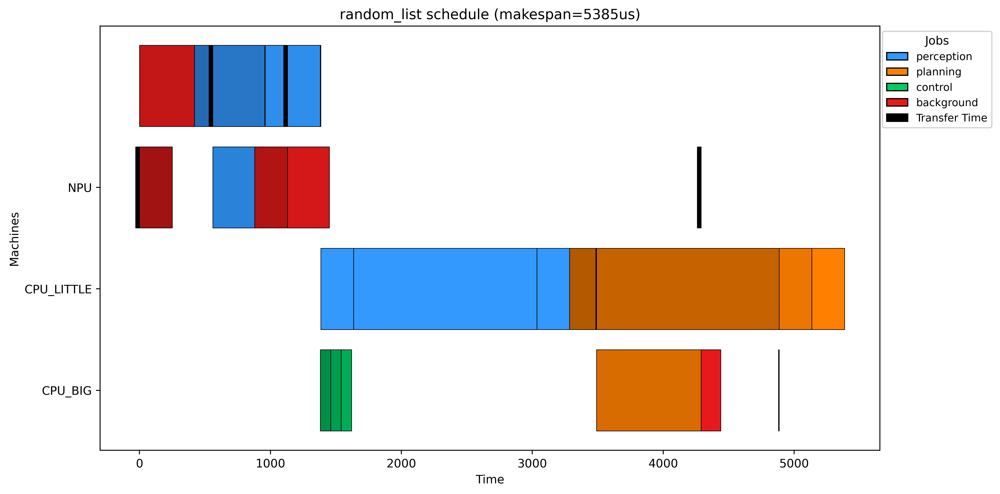

# M2 baselines — synthetic heterogeneous workload

| Scheduler | Ops | Makespan (us) | Non-periodic makespan (us) | p95 op (us) | p99 op (us) | Deadline misses | Miss ratio | Total lateness (us) | Max lateness (us) | Cross-device transitions | Critical path (us) | Peak DRAM (B) | Peak scratchpad (B) | Solver time (s) |
|---|---|---|---|---|---|---|---|---|---|---|---|---|---|---|
| mosek | 20 | 2,400.0 | 2,400.0 | 334.000 | 546.800 | 0 | 0.000 | 0.000 | 0.000 | 10 | 1,880.0 | - | - | 3.040 |
| heft | 20 | 3,155.0 | 3,155.0 | 424.000 | 484.800 | 1 | 0.050 | 1,655.0 | 1,655.0 | 10 | 1,880.0 | - | - | 0.001 |
| critical_path | 20 | 3,895.0 | 3,895.0 | 830.000 | 1,286.0 | 1 | 0.050 | 2,395.0 | 2,395.0 | 6 | 3,720.0 | - | - | 0.001 |
| edf | 20 | 3,840.0 | 3,840.0 | 830.000 | 1,286.0 | 1 | 0.050 | 590.000 | 590.000 | 5 | 3,720.0 | - | - | 0.001 |
| fastest_device | 20 | 3,640.0 | 3,640.0 | 320.000 | 320.000 | 0 | 0.000 | 0.000 | 0.000 | 12 | 1,880.0 | - | - | 0.000 |
| fifo | 20 | 4,295.0 | 4,295.0 | 1,020.0 | 1,324.0 | 0 | 0.000 | 0.000 | 0.000 | 7 | 4,150.0 | - | - | 0.000 |
| random_list | 20 | 5,385.0 | 5,385.0 | 1,400.0 | 1,400.0 | 1 | 0.050 | 120.000 | 120.000 | 7 | 4,950.0 | - | - | 0.000 |

## Per-scheduler Gantts

### mosek

[schedule json](../../schedules/m2_baselines/scheduled_m2_synthetic_mosek.json)

### heft

[schedule json](../../schedules/m2_baselines/scheduled_m2_synthetic_heft.json)

### critical_path

[schedule json](../../schedules/m2_baselines/scheduled_m2_synthetic_critical_path.json)

### edf

[schedule json](../../schedules/m2_baselines/scheduled_m2_synthetic_edf.json)

### fastest_device

[schedule json](../../schedules/m2_baselines/scheduled_m2_synthetic_fastest_device.json)

### fifo

[schedule json](../../schedules/m2_baselines/scheduled_m2_synthetic_fifo.json)

### random_list

[schedule json](../../schedules/m2_baselines/scheduled_m2_synthetic_random_list.json)
