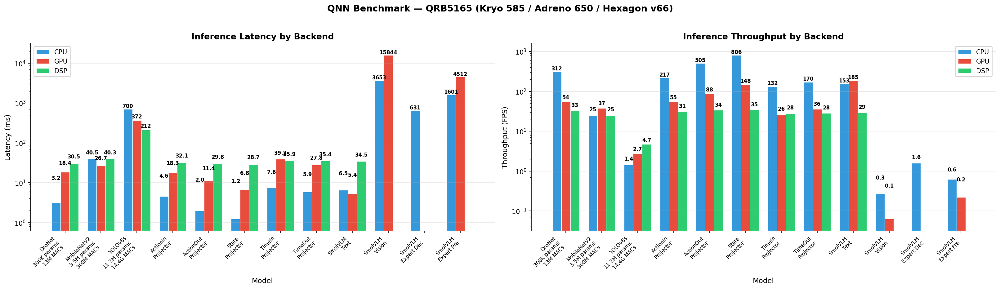

# QNN Model Benchmarking Pipeline

End-to-end pipeline for exporting neural network models to ONNX, converting
them to Qualcomm AI Engine Direct (QNN) DLC format, deploying to a QRB5165
board, and benchmarking across CPU / GPU / DSP backends.

## Quick Start

```bash
# Full pipeline — all 3 baseline models:
./deploy.sh

# Single model:
./deploy.sh --model=dronet
./deploy.sh --model=mobilenet_v2
./deploy.sh --model=yolov8s

# All 9 SmolVLA submodels:
./deploy.sh --model=smolvla

# Single SmolVLA submodel (expert models need --reconvert):
./deploy.sh --model=smolvlm_expert_decode --reconvert

# Re-run benchmarks only (models already on board):
./deploy.sh --run-only --iters=50

# Partial pipeline:
./deploy.sh --export-only       # just export ONNX
./deploy.sh --convert-only      # just convert + quantize (Docker required)
```

## Tutorial: Converting ONNX to QNN DLC

This section walks through converting any ONNX model to QNN DLC format for
deployment on Qualcomm hardware.

### Step 1 — Prepare the ONNX Model

Ensure your ONNX model uses **opset <= 17** and **IR version <= 9**. The QNN
SDK v2.45 converter does not support newer opset versions (e.g., Shape v21,
Equal v19, ScatterND v18 will fail).

```bash
# Check your model's opset version:
python3 -c "
import onnx
m = onnx.load('model.onnx', load_external_data=False)
opset = [o for o in m.opset_import if o.domain in ('', 'ai.onnx')][0]
print(f'opset={opset.version}, ir_version={m.ir_version}')
"
```

### Step 2 — Simplify and Convert ONNX to DLC

The conversion runs inside Docker to isolate the QNN SDK Python dependencies.
For single-input 4D models (images), the standard path is:

```bash
# One-command approach via deploy.sh:
./deploy.sh --input=model.onnx --convert-only

# Or manually via Docker:
sudo docker run --rm \
    -v /path/to/qairt/sdk:/qnn:ro \
    -v /path/to/model/dir:/workspace \
    qnn-convert bash -c "
        pip install -q onnxruntime onnx-simplifier 'numpy<2' &&
        python3.10 -c \"
import onnx
from onnxsim import simplify
model = onnx.load('/workspace/model.onnx')
model_simp, _ = simplify(model)
onnx.save(model_simp, '/workspace/model_simplified.onnx')
\" &&
        python3.10 /qnn/bin/x86_64-linux-clang/snpe-onnx-to-dlc \
            --input_network /workspace/model_simplified.onnx \
            --input_layout input_name NCHW \
            --output_path /workspace/model.dlc
"
```

### Input Layout Flags

The `--input_layout` flag tells the converter how to interpret each input
tensor's dimensions. Getting this wrong causes shape mismatches or silent
correctness bugs:

| Input Rank | Layout Flag | Example |
|------------|------------|---------|
| 4D (batch, channels, H, W) | `NCHW` | Image tensors `[1,3,224,224]` |
| Non-4D (2D, 3D, etc.) | `NONTRIVIAL` | Token IDs `[1,177]`, embeddings `[1,50,720]` |

For multi-input models, specify per-input flags:

```bash
snpe-onnx-to-dlc \
    --input_network model.onnx \
    -d attention_mask 1,177,177  --input_layout attention_mask NONTRIVIAL \
    -d position_ids 1,177        --input_layout position_ids NONTRIVIAL \
    -d vlm_embeds 1,177,960      --input_layout vlm_embeds NONTRIVIAL \
    --output_path model.dlc
```

Without `NONTRIVIAL`, the converter auto-assigns spatial layouts (e.g., NCF for
3D tensors), which causes GPU backend validation failures on ops that don't
support those formats.

### Step 3 — Quantize to INT8 (Optional, Required for DSP)

```bash
# Generate calibration data (10 random samples):
python3 -c "
import numpy as np
for i in range(10):
    np.random.randn(1, 3, 224, 224).astype(np.float32).tofile(f'cal_{i}.raw')
"

# Write calibration list:
ls cal_*.raw | sed 's|^|/workspace/|' > calibration_list.txt

# Quantize:
sudo docker run --rm -v /path/to/sdk:/qnn:ro -v $PWD:/workspace qnn-convert \
    python3.10 /qnn/bin/x86_64-linux-clang/qairt-quantizer \
        --input_dlc /workspace/model.dlc \
        --output_dlc /workspace/model_quantized.dlc \
        --input_list /workspace/calibration_list.txt \
        --act_bitwidth 8 --weights_bitwidth 8 --bias_bitwidth 8
```

### Step 4 — Deploy and Benchmark on Board

```bash
# Copy model and benchmark script to board:
scp model.dlc root@10.44.120.201:/root/models/mymodel/model.dlc
scp benchmark_qnn.sh root@10.44.120.201:/root/models/mymodel/

# Generate dummy input on board:
ssh root@10.44.120.201 "python3 -c \"
import numpy as np
np.random.randn(1,3,224,224).astype(np.float32).tofile('/root/models/mymodel/input.raw')
with open('/root/models/mymodel/input_list.txt','w') as f:
    f.write('input_name:=/root/models/mymodel/input.raw\n')
\""

# Run benchmark:
ssh root@10.44.120.201 "bash /root/models/mymodel/benchmark_qnn.sh \
    /root/models/mymodel mymodel 50"
```

The `tensor_name:=filepath` format in `input_list.txt` maps inputs by name
rather than position. This is critical for multi-input models because the DLC
converter may reorder inputs internally.

## SmolVLA Profiling Guide

[SmolVLA](https://huggingface.co/ainekko/smolvla_base_onnx) is a vision-language-action model
with 9 subcomponents exported as individual ONNX models:

| Submodel | Inputs | Shape | ONNX Size | Role |
|----------|--------|-------|-----------|------|
| `action_in_projector` | action | [1,50,32] | <1 MB | Project raw actions into expert embedding space |
| `action_out_projector` | action | [1,50,720] | <1 MB | Project expert outputs back to action space |
| `state_projector` | state | [1,32] | <1 MB | Project robot state into embedding space |
| `time_in_projector` | time | [1,50,1440] | 4 MB | Encode timestep information for diffusion |
| `time_out_projector` | time | [1,50,720] | 2 MB | Decode timestep from expert space |
| `smolvlm_text` | tokens | [?,?] | 189 MB | Language model text encoder |
| `smolvlm_vision` | image | [1,3,512,512] | 393 MB | SigLIP vision encoder |
| `smolvlm_expert_decode` | 35 inputs (KV-cache) | varies | 399 MB | Transformer expert, autoregressive decode step |
| `smolvlm_expert_prefill` | 3 inputs | varies | 644 MB | Transformer expert, prefill pass |

### Download Pre-exported ONNX Models

```bash
hf download ainekko/smolvla_base_onnx --local-dir smolVLA/
```

### Profile All SmolVLA Models

**Step 1 — Convert and profile the 7 simpler submodels** (single-input, no KV-cache):

```bash
# Profile each model one at a time via deploy.sh:
for model in action_in_projector action_out_projector state_projector \
             time_in_projector time_out_projector smolvlm_text smolvlm_vision; do
    ./deploy.sh --input=smolVLA/${model}.onnx --iters=50
done
```

**Step 2 — Profile the expert models** (multi-input, requires special handling):

```bash
# Expert models need --reconvert to skip onnxsim (incompatible IR version)
# and apply --input_layout NONTRIVIAL for non-4D inputs:
./deploy.sh --model=smolvlm_expert_decode --reconvert --iters=50
./deploy.sh --model=smolvlm_expert_prefill --reconvert --iters=50
```

The `--reconvert` flag skips onnx-simplifier (which chokes on IR version > 10)
and converts directly from the original ONNX with proper layout flags.

**Step 3 — Export results to CSV:**

```bash
./deploy.sh --run-only --profile-csv=smolvla_benchmarks.csv
```

### Benchmark Results

All measurements are per-inference latency in milliseconds on the QRB5165
(Kryo 585 CPU, Adreno 650 GPU, Hexagon v66 DSP). 50 iterations, batch size 1.

```
Submodel                   CPU (ms)   GPU (ms)   DSP (ms)
---------------------------------------------------------
state_projector               1.24       6.76      28.72
action_out_projector          1.98      11.40      29.76
action_in_projector           4.60      18.26      32.06
time_out_projector            5.88      27.80      35.36
smolvlm_text                  6.52       5.40      34.50
time_in_projector             7.60      39.16      35.92
smolvlm_expert_decode       630.96         -          -
yolov8s (reference)         700.40     371.56     212.46
smolvlm_expert_prefill     1601.00    4511.84        -
smolvlm_vision             3652.94   15844.30        -
```

`-` = backend not supported for this model (GPU op incompatibility or missing quantized DLC).



### Interpretation

**Projectors are fast and bottleneck-free.** The five projector submodels
(state, action_in/out, time_in/out) are small linear layers running at
1-8 ms on CPU. These contribute negligible latency (<30 ms combined) to the
full SmolVLA inference pipeline. CPU is the fastest backend for these because
the tensors are too small to amortize GPU/DSP dispatch overhead.

**smolvlm_text is surprisingly lightweight.** At 6.5 ms on CPU and 5.4 ms on
GPU, the text encoder is not a bottleneck. This is because it runs a single
forward pass over a short token sequence, unlike autoregressive generation.

**The vision encoder dominates single-frame latency.** `smolvlm_vision`
(SigLIP, 393 MB) takes 3.6 seconds on CPU and 15.8 seconds on GPU for a
single 512x512 image. This is the primary bottleneck for real-time
applications. GPU is slower than CPU here because the Adreno 650 has limited
memory bandwidth and the vision transformer's attention operations don't map
efficiently to mobile GPU shader cores.

**Expert models are compute-heavy but viable on CPU.** `smolvlm_expert_decode`
runs at 631 ms on CPU (1.6 FPS per decode step). `smolvlm_expert_prefill` runs
at 1.6 seconds on CPU. The decode model has 35 inputs (3 primary + 32
KV-cache tensors across 16 layers), making it the most complex submodel.
GPU failed for expert_decode due to unsupported transformer ops (ScatterND,
complex broadcast patterns) on the Adreno 650 shader compiler.

**DSP is a poor fit for transformer models.** The Hexagon v66 DSP only runs
INT8 quantized models and is optimized for convolution-heavy architectures.
None of the transformer-based submodels (text, vision, expert) have quantized
DLCs because quantizing attention mechanisms typically requires
quantization-aware training to maintain accuracy. The DSP adds ~30 ms fixed
overhead even for tiny projectors, making it slower than CPU for everything
under ~200 ms.

**End-to-end SmolVLA latency estimate on QRB5165 (CPU-only path):**
~5.9 seconds per action (3.65s vision + 1.60s prefill + 0.63s decode + ~0.03s
projectors). This is far from real-time (target: 5-10 Hz), indicating that the
QRB5165 is insufficient for full SmolVLA inference without significant model
optimization (distillation, pruning, or offloading vision to a more capable
accelerator).

## Conversion Flow

DroNet and MobileNetV2 use the standard ONNX-to-DLC path.  YOLOv8s requires
an intermediate TFLite step because the QNN SDK v2.45 ONNX converter has a
C++ shape-inference bug on models with SiLU activations + residual blocks.

```
                          DroNet / MobileNetV2
                          ~~~~~~~~~~~~~~~~~~~~
  PyTorch model
       |
       v
  +-------------+   export_onnx.py
  |  ONNX model |   export_mobilenet.py
  |  (NCHW fp32)|
  +------+------+
         |  onnx-simplifier (Docker)
         v
  +-------------+
  | Simplified  |
  |    ONNX     |
  +------+------+
         |  snpe-onnx-to-dlc --input_layout <name> NCHW (Docker)
         v
  +-------------+
  | Float32 DLC |--------------------> CPU / GPU backend
  |  (NHWC)     |
  +------+------+
         |  qairt-quantizer --act_bitwidth 8 (Docker)
         v
  +-------------+
  |  INT8 DLC   |--------------------> DSP backend (Hexagon v66)
  |  (NHWC)     |
  +-------------+


                         SmolVLA Submodels
                         ~~~~~~~~~~~~~~~~~
  Pre-exported ONNX (from HuggingFace)
       |
       v
  +-------------+
  |  ONNX model |   opset 17, various input ranks (2D, 3D, 4D)
  |  (fp32)     |
  +------+------+
         |  onnx-simplifier + snpe-onnx-to-dlc (Docker)
         |  --input_layout <name> NCHW     (for 4D inputs)
         |  --input_layout <name> NONTRIVIAL (for non-4D inputs)
         |  -d <name> <dims>               (for all inputs)
         v
  +-------------+
  | Float32 DLC |--------------------> CPU / GPU backend
  +------+------+
         |  qairt-quantizer (projectors only)
         v
  +-------------+
  |  INT8 DLC   |--------------------> DSP backend (projectors only)
  +-------------+


                             YOLOv8s
                             ~~~~~~~
  PyTorch model (ultralytics)
       |
       v
  +-------------+   export_yolo.py (includes onnxslim)
  |  ONNX model |
  |  (NCHW fp32)|
  +------+------+
         |  onnx2tf (host conda env)      <-- workaround: QNN ONNX converter
         v                                    fails on SiLU + residual blocks
  +-------------+
  |  TFLite     |
  | (NHWC fp32) |
  +------+------+
         |  snpe-tflite-to-dlc (Docker)
         v
  +-------------+
  | Float32 DLC |--------------------> CPU / GPU backend
  |  (NHWC)     |
  +------+------+
         |  qairt-quantizer --act_bitwidth 8 (Docker)
         v
  +-------------+
  |  INT8 DLC   |--------------------> DSP backend (Hexagon v66)
  |  (NHWC)     |
  +-------------+
```

After conversion, models are scp'd to the board and benchmarked with
`qnn-net-run` across all backends.  Results are collected into
`benchmark_results.json` and plotted to `plots/qnn_benchmark.png`.

## Prerequisites

### 1. Host Machine

**Conda environment** (`xpurt`):

```bash
conda create -n xpurt python=3.11
conda activate xpurt
pip install torch torchvision          # ONNX export
pip install ultralytics                # YOLOv8s export
pip install onnx2tf tensorflow-cpu     # ONNX -> TFLite (YOLOv8s path)
pip install matplotlib                 # plotting
```

**Docker** with sudo access (or add your user to the `docker` group):

```bash
# The Dockerfile is built automatically on first run.
# To build manually:
sudo docker build -f Dockerfile.qnn-convert -t qnn-convert .
```

**Qualcomm AI Engine Direct SDK** (QNN / QAIRT) v2.45.0:

```
/scratch2/dima/misc_sw/qualcomm/qairt/2.45.0.260326/
├── bin/x86_64-linux-clang/
│   ├── snpe-onnx-to-dlc        # ONNX -> DLC converter
│   ├── snpe-tflite-to-dlc      # TFLite -> DLC converter
│   └── qairt-quantizer          # DLC quantizer (float32 -> INT8)
└── lib/
    ├── python/                  # Python bindings (used inside Docker)
    └── x86_64-linux-clang/      # Host-side native libraries
```

To use a different SDK version or path, edit `QNN_SDK=` in `deploy.sh`.

### 2. QRB5165 Board

The board must be reachable via SSH without a password prompt:

```bash
ssh root@10.44.120.201    # should connect without prompting
```

**Board-side QNN runtime** must be pre-installed at `/root/qairt/`:

```
/root/qairt/
├── bin/target/
│   └── qnn-net-run              # on-device inference tool
├── lib/target/
│   ├── libQnnCpu.so             # CPU backend
│   ├── libQnnGpu.so             # GPU backend (Adreno 650)
│   └── libQnnDsp.so             # DSP backend (Hexagon v66 stub)
└── lib/hexagon-v66/
    ├── libQnnDspV66Skel.so      # DSP skel library (runs on CDSP)
    ├── libQnnDspV66.so
    └── libCalculator_skel.so
```

The DSP skel libraries can be copied from the host SDK:

```bash
# One-time setup for DSP backend:
ssh root@10.44.120.201 'mkdir -p /root/qairt/lib/hexagon-v66'
scp $QNN_SDK/lib/hexagon-v66/unsigned/libQnnDspV66Skel.so \
    $QNN_SDK/lib/hexagon-v66/unsigned/libCalculator_skel.so \
    $QNN_SDK/lib/hexagon-v66/unsigned/libQnnDspV66.so \
    root@10.44.120.201:/root/qairt/lib/hexagon-v66/
```

To change the board IP or user, edit `BOARD_IP=` / `BOARD_USER=` in `deploy.sh`.

## File Inventory

| File | Purpose |
|------|---------|
| `deploy.sh` | Main entry point -- orchestrates full pipeline (export, convert, deploy, benchmark) |
| `benchmark_qnn.sh` | On-board benchmark script (scp'd to board, runs `qnn-net-run`) |
| `plot_benchmarks.py` | Generate benchmark comparison plot from results JSON |
| `Dockerfile.qnn-convert` | Docker image providing Ubuntu 22.04 + Python 3.10 + QNN SDK deps |
| `dronet.py` | DroNet model definition (PyTorch) |
| `export_onnx.py` | Export DroNet to ONNX |
| `export_mobilenet.py` | Export MobileNetV2 to ONNX |
| `export_yolo.py` | Export YOLOv8s to ONNX |
| `onnx2tf_convert.py` | ONNX -> TFLite via onnx2tf (YOLOv8s workaround) |
| `smolVLA/` | Directory containing all SmolVLA ONNX models, DLCs, and calibration data |

## Hardware Notes

**QRB5165 (SM8250 / KONA)**:
- **CPU**: Kryo 585 (Cortex-A77 + A55) -- best for small models and transformers
- **GPU**: Adreno 650 -- competitive at medium convolution-heavy model sizes; limited transformer op support
- **DSP**: Hexagon v66 (CDSP) -- requires INT8 quantized models; high fixed overhead (~30 ms) makes it only worthwhile for models >200 ms on CPU
- **HTP**: Not available (requires Hexagon v68+, SM8350+)

## Known Issues

- **QNN SDK v2.45 ONNX converter bug**: The C++ `infer_output_shapes` function
  produces garbage tensor dimensions on models with SiLU (Sigmoid Linear Unit)
  activations combined with residual connections (e.g., YOLOv8, YOLOv5).  The
  workaround is to convert ONNX -> TFLite (natively NHWC) -> DLC.

- **Opset version ceiling**: The QNN SDK v2.45 converter supports ONNX opset
  <= 17. Models exported with opset 18+ (Shape v21, Equal v19, ScatterND v18)
  will fail with `getBroadcastedShape` or `OP_VERSION_NOT_SUPPORTED` errors.
  Do not upgrade ONNX opset versions -- the board runs DLCs, not ONNX.

- **onnx-simplifier IR version limit**: The onnx-simplifier bundled in the
  Docker image supports IR version <= 10. Models with IR version 13 (onnx
  1.21.0) will fail simplification. The converter will log a warning and
  proceed without simplification.

- **Multi-input DLC reordering**: The DLC converter may internally reorder
  inputs. Use `tensor_name:=filepath` format in `input_list.txt` to map
  inputs by name, not position. Positional mapping causes silent data
  corruption (wrong tensor fed to wrong input).

- **GPU unsupported transformer ops**: The Adreno 650 GPU backend does not
  support ScatterND, complex broadcast patterns, and certain attention
  mechanisms. Transformer-based models (expert_decode, vision) may fail on GPU.
  CPU is the reliable fallback.

- **DSP v66 datatype restrictions**: The Hexagon v66 DSP only supports INT8
  (uFxp_8) tensors -- not float32, not sFxp_32 biases.  Quantization must use
  `--bias_bitwidth 8` (not 32).

- **FastRPC for DSP**: The DSP backend communicates via FastRPC.  The skel
  libraries must be deployed to a writable path listed in `ADSP_LIBRARY_PATH`
  (e.g., `/root/qairt/lib/hexagon-v66`).
