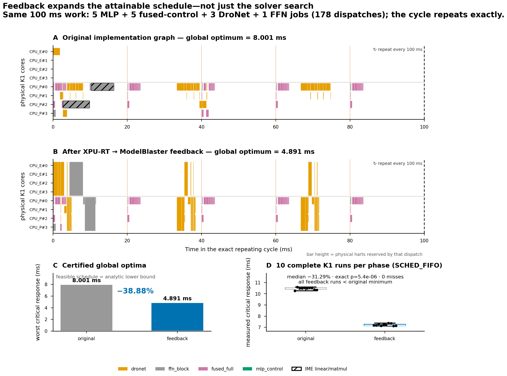

# Exact-cycle feedback result

The strongest result in this repository is:

> On exactly the same repeating 100 ms workload, XPU-RT→ModelBlaster
> feedback lowers the **globally optimal** worst critical-model response from
> 8.001335 ms to 4.890542 ms, a **38.88% reduction**. Ten complete real-time
> runs of each schedule on a SpaceMiT K1 corroborate it: the measured median
> falls 10.491000→7.208521 ms (**31.29%**), and every feedback run is faster
> than every original run (exact one-sided rank-sum p=5.41×10⁻⁶).



[Vector PDF](exact_cycle_feedback.pdf) ·
[machine-readable proof](result.json) ·
[board result](board_result.json)

## Why this is stronger than a solver comparison

The comparison does not claim that Greedy happened to beat MOSEK or CP-SAT.
It proves that no scheduler can close the gap while confined to the original
implementation graph:

1. Both phases contain the same 14 jobs and 178 dispatches: five
   `mlp_control`, five `fused_full`, three `dronet`, and one `ffn_block`.
   Models, releases, periods, hardware, objective, and measured K1 profile
   corpus are unchanged.
2. The only semantic input changes expose measured multi-hart implementations:
   `machine_combination_mode: singletons→shard` and
   `topo_tag_override: true→false`.
3. Each schedule passes exact instance-count, release, deadline, dependency,
   physical-core exclusivity, and cyclic-boundary validation. The 100 ms
   boundary is clear, so the displayed schedule repeats indefinitely; it is
   not a crop with a long single-model tail hidden off-screen.
4. For each model, the validator computes a solver-independent lower bound:
   the critical path using the fastest legal measured implementation of every
   dispatch, assuming unlimited cores and no contention. No real scheduler can
   beat that bound.
5. The original feasible schedule attains its 8.001335 ms bound. It is
   therefore globally optimal over the original graph. The feedback schedule
   attains its own 4.890542 ms bound and is globally optimal over the expanded
   graph.
6. Since the feedback result is below the original graph's lower bound, the
   38.88% separation came from feedback changing what is implementable, not
   from solver luck or additional search time.

The proof runner also recomputes the aggregate profile-database hash and the
SHA-256 of every referenced K1 measurement CSV. It refuses to certify a
schedule if the measured cost corpus has drifted since that schedule was
created.

The predicted heavy-model response also falls 16.552833→11.558584 ms
(30.17%). This secondary metric is not needed for the separation proof.

## How to explain the figure

- **A — original optimum.** This is the best response any scheduler can
  achieve when every dispatch is restricted to the original implementation
  choices. Blank regions are legal slack between periodic releases, not
  missing work.
- **B — feedback optimum.** The release pattern and amount of work are
  identical. Taller bars reserve multiple physical harts for one dispatch;
  XPU-RT selected their width and ModelBlaster generated and ran that exact
  implementation. The schedule closes cleanly at 100 ms and can repeat.
- **C — certificate.** In each phase, a feasible schedule equals the analytic
  lower bound. This equality is what converts “best schedule found” into
  “global optimum.” The strict gap between the two bars cannot be recovered by
  MOSEK, CP-SAT, Greedy, or any other scheduler on the original graph.
- **D — hardware corroboration.** Each point is one complete 178-dispatch K1
  run under audited `SCHED_FIFO` priority 80. All twenty runs have zero
  deadline misses and pass their embedded numerical goldens. The two ranges do
  not overlap; the feedback median is 31.29% lower. Hardware values are larger
  than the profile-based prediction because the board trace includes
  synchronization, launch, and runtime effects that the dispatch-cost model
  does not model.

The dotted 20 ms lines in A and B mark the fastest periodic release/deadline
grid. Hatched work is a genuine IME `linear`/`matmul` implementation. A
multi-hart dispatch is one vertically spanning rectangle, because it holds all
of those physical lanes simultaneously.

## Reproduce the proof and figure

The checked-in schedules are regenerated with `run_xpurt_schedule.py` and then
certified with:

```bash
.venv/bin/python scripts/run_exact_cycle_feedback.py \
  --original-workload data/toplevel/networks_k1_tri_exact_100ms.json \
  --original-schedule schedules/scheduled_networks_k1_tri_exact_100ms_greedy_profiled.json \
  --feedback-workload data/toplevel/networks_k1_tri_exact_100ms_feedback.json \
  --feedback-schedule schedules/scheduled_networks_k1_tri_exact_100ms_feedback_greedy_profiled.json \
  --critical-model mlp_control --critical-model fused_full \
  --critical-model dronet --heavy-model ffn_block \
  --feedback-artifact results/k1_feedback_story/data/original_xpurt_feedback.json \
  --board-result results/k1_feedback_exact/board_result.json \
  --snapshot-dir results/k1_feedback_exact/data \
  --out results/k1_feedback_exact/result.json

.venv/bin/python scripts/plot_exact_cycle_feedback.py \
  --result results/k1_feedback_exact/result.json \
  --board-result results/k1_feedback_exact/board_result.json \
  --out results/k1_feedback_exact/exact_cycle_feedback
```

The raw headline board evidence is under
[`board_runs_rt_observed/`](board_runs_rt_observed/).
The evaluator
checks all 178 trace rows per run, positive execution intervals, every
schedule-issued earliest start, the 100 ms runtime boundary, requested
master-hart placement, worker affinity, exact composite-pool creation, absence
of `FATAL`/`FAIL`, matching requested and in-process-observed real-time policy,
embedded golden outputs, and deadline results. It also requires ten matched
runs per phase and reports the exact one-sided rank-sum test. Rebuild and run
commands are recorded in
[`docs/the_loop.md`](../../docs/the_loop.md).

The scheduled Linux harness captures each model's first *complete* periodic
instance only after every DAG leaf has finished, then compares it in-process
with the baked one-invocation golden. `mlp_control`, `dronet`, and `ffn_block`
are bit-exact in every run. Stateful FP16 `fused_full` has
`max_abs_err=0.000183105469` and `max_rel_err=0.00162337662`, within its
`1e-2` tolerances. Later `fused_full` instances deliberately are not compared
with a one-invocation golden because their recurrent state has evolved.

The earlier default-Linux-scheduler exploration is preserved under
[`board_runs/`](board_runs/). It exposed preemption outliers, including four
deadline misses in one feedback run, and is not used by `board_result.json`.
Rather than dropping that sample, the final protocol explicitly runs *both*
phases under the same real-time policy; every log records and the evaluator
audits that policy.
