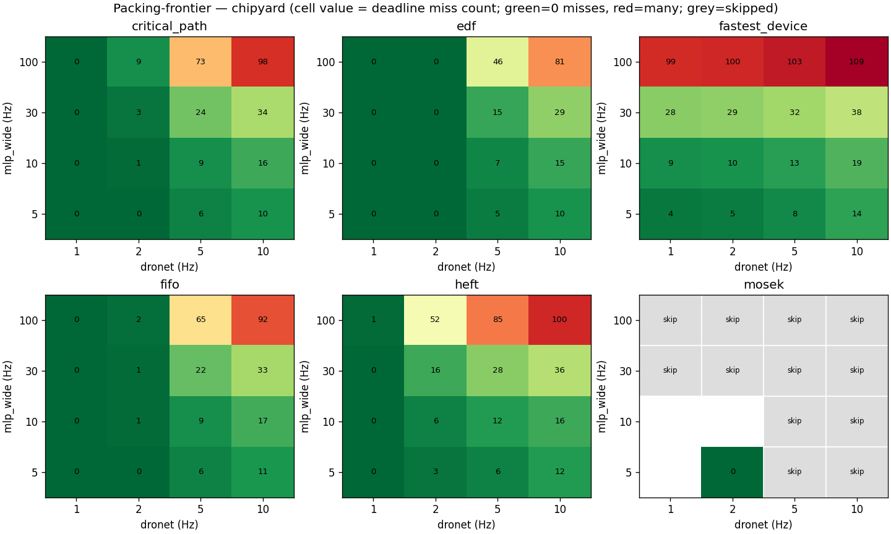
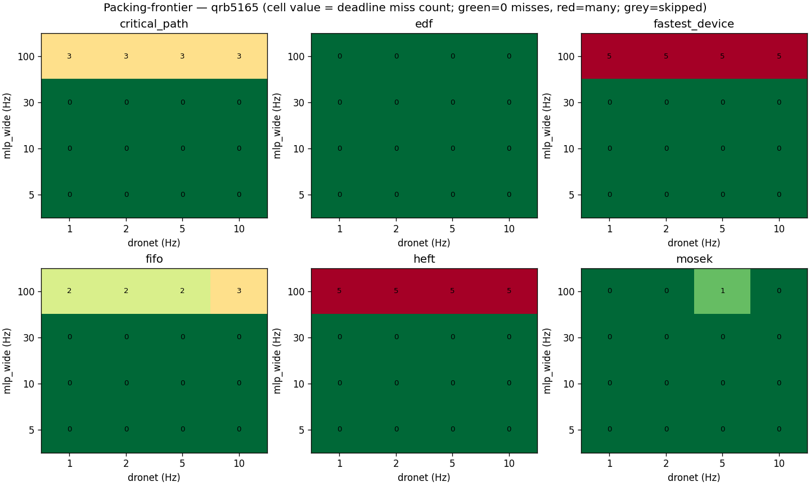

# M4 — robotic packing stress test

- envelope_us per soc: {'chipyard': 1000000.0, 'qrb5165': 50000.0}
- time_scale: 100.0 (firesim/silicon compression)
- dronet frequencies: 1,2,5,10
- mlp_wide frequencies: 5,10,30,100
- schedulers: ['heft', 'fastest_device', 'critical_path', 'edf', 'fifo', 'mosek']

## chipyard

| scheduler | feasible cells with 0 misses | total misses (across all cells) | cells skipped |
|---|---:|---:|---:|
| heft | 3 | 373 | 0 |
| fastest_device | 0 | 620 | 0 |
| critical_path | 5 | 283 | 0 |
| edf | 8 | 208 | 0 |
| fifo | 5 | 259 | 0 |
| mosek | 1 | 0 | 12 |

**Tightest cell** (10 Hz dronet, 100 Hz mlp_wide): best scheduler is `edf` with 81 deadline misses.

## qrb5165

| scheduler | feasible cells with 0 misses | total misses (across all cells) | cells skipped |
|---|---:|---:|---:|
| heft | 12 | 20 | 0 |
| fastest_device | 12 | 20 | 0 |
| critical_path | 12 | 12 | 0 |
| edf | 16 | 0 | 0 |
| fifo | 12 | 9 | 0 |
| mosek | 15 | 1 | 0 |

**Tightest cell** (10 Hz dronet, 100 Hz mlp_wide): best scheduler is `edf` with 0 deadline misses.
