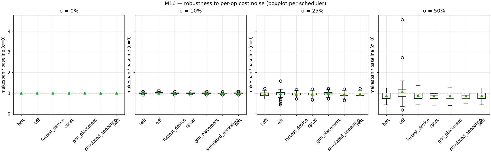

# M16 — Noise robustness sweep

- workloads: 12
- sigmas (% one-sigma multiplicative jitter): [0.0, 10.0, 25.0, 50.0]
- schedulers: ['heft', 'edf', 'fastest_device', 'cpsat', 'gnn_placement', 'simulated_annealing', 'peft']

## Mean / p95 makespan ratio vs σ=0 baseline (lower is more robust)

| scheduler | σ=0 mean | σ=10% mean | σ=25% mean | σ=50% mean | σ=25% p95 | σ=50% p95 |
|---|---:|---:|---:|---:|---:|---:|
| heft | 1.000 | 0.997 | 0.953 | 0.864 | 1.095 | 1.131 |
| edf | 1.000 | 0.999 | 0.959 | 1.058 | 1.132 | 1.575 |
| fastest_device | 1.000 | 0.998 | 0.955 | 0.897 | 1.096 | 1.287 |
| cpsat | 1.000 | 0.995 | 0.947 | 0.865 | 1.075 | 1.170 |
| gnn_placement | 1.000 | 1.000 | 0.979 | 0.872 | 1.189 | 1.132 |
| simulated_annealing | 1.000 | 0.992 | 0.946 | 0.862 | 1.095 | 1.130 |
| peft | 1.000 | 0.995 | 0.950 | 0.867 | 1.095 | 1.131 |