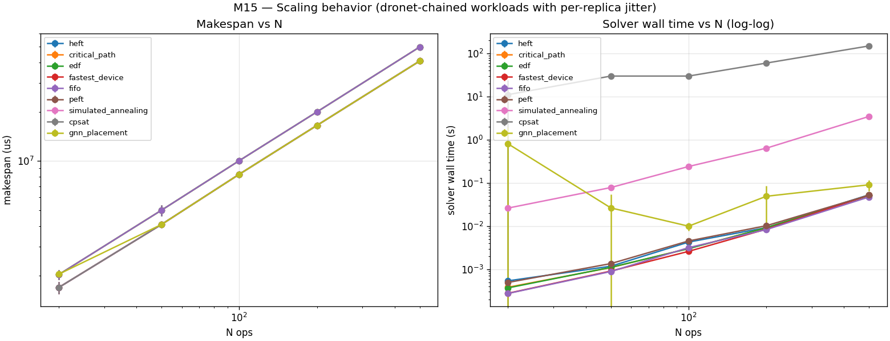

# M15 — Scaling sweep

- sizes: [20, 50, 100, 200, 500]
- schedulers: ['heft', 'critical_path', 'edf', 'fastest_device', 'fifo', 'peft', 'simulated_annealing', 'cpsat', 'gnn_placement']

## Solver wall time (s) at each N — median across seeds

| scheduler | N=20 | N=50 | N=100 | N=200 | N=500 |
|---|---:|---:|---:|---:|---:|
| heft | 0.001 | 0.001 | 0.005 | 0.009 | 0.053 |
| critical_path | 0.000 | 0.001 | 0.003 | 0.009 | 0.050 |
| edf | 0.000 | 0.001 | 0.003 | 0.009 | 0.052 |
| fastest_device | 0.000 | 0.001 | 0.003 | 0.008 | 0.048 |
| fifo | 0.000 | 0.001 | 0.003 | 0.008 | 0.047 |
| peft | 0.000 | 0.001 | 0.005 | 0.010 | 0.052 |
| simulated_annealing | 0.026 | 0.077 | 0.242 | 0.636 | 3.471 |
| cpsat | 2.642 | 30.057 | 30.045 | 60.093 | 150.189 |
| gnn_placement | 0.019 | 0.010 | 0.010 | 0.030 | 0.073 |

## Makespan vs N (median, us)

| scheduler | N=20 | N=50 | N=100 | N=200 | N=500 |
|---|---:|---:|---:|---:|---:|
| heft | 1,603,508 | 4,187,595 | 8,301,482 | 16,603,597 | 40,960,318 |
| critical_path | 2,046,635 | 5,033,697 | 10,135,785 | 19,781,011 | 49,425,679 |
| edf | 2,046,635 | 5,033,697 | 10,135,785 | 19,781,011 | 49,425,679 |
| fastest_device | 1,603,508 | 4,187,595 | 8,301,482 | 16,603,597 | 40,960,318 |
| fifo | 2,046,635 | 5,033,697 | 10,135,785 | 19,781,011 | 49,425,679 |
| peft | 1,603,508 | 4,187,595 | 8,301,482 | 16,603,597 | 40,960,318 |
| simulated_annealing | 1,603,508 | 4,187,595 | 8,301,482 | 16,603,597 | 40,960,318 |
| cpsat | 1,603,506 | 4,187,593 | 8,301,485 | 16,603,591 | 40,960,312 |
| gnn_placement | 2,043,181 | 4,187,595 | 8,301,482 | 16,603,597 | 40,960,318 |