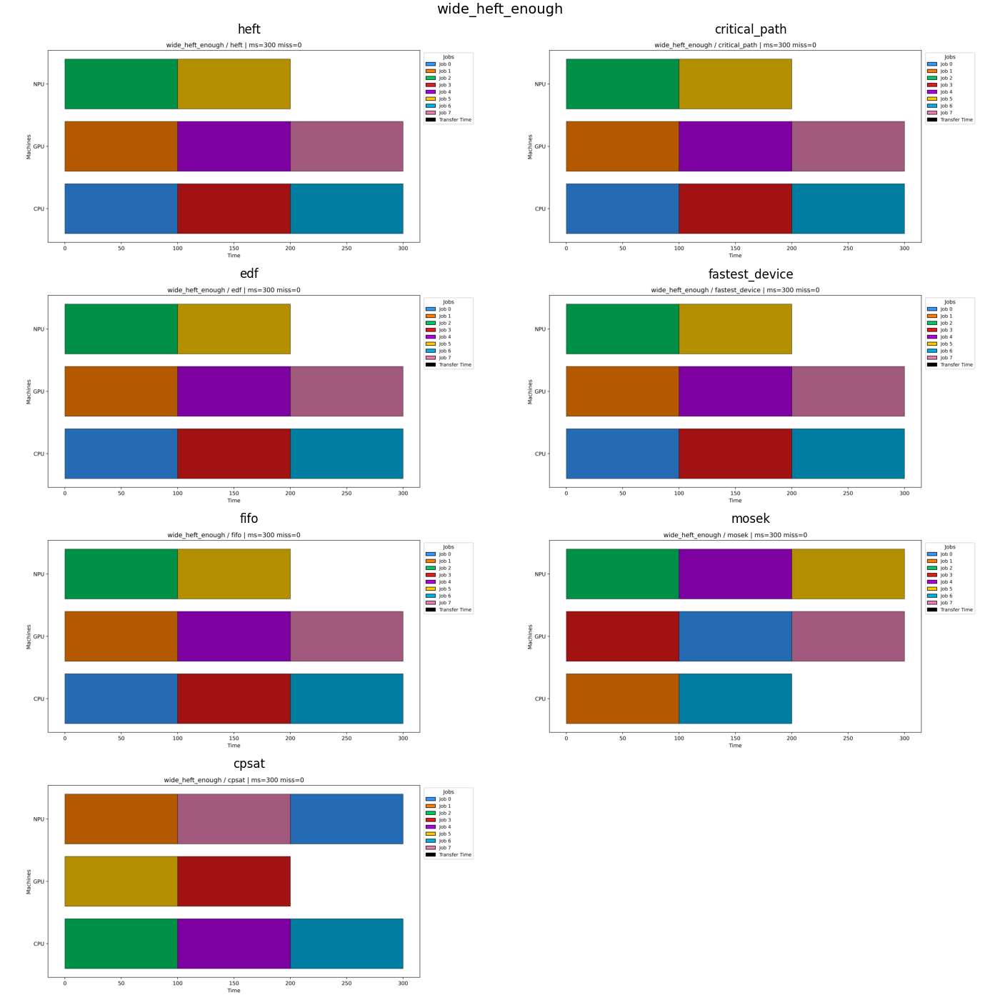
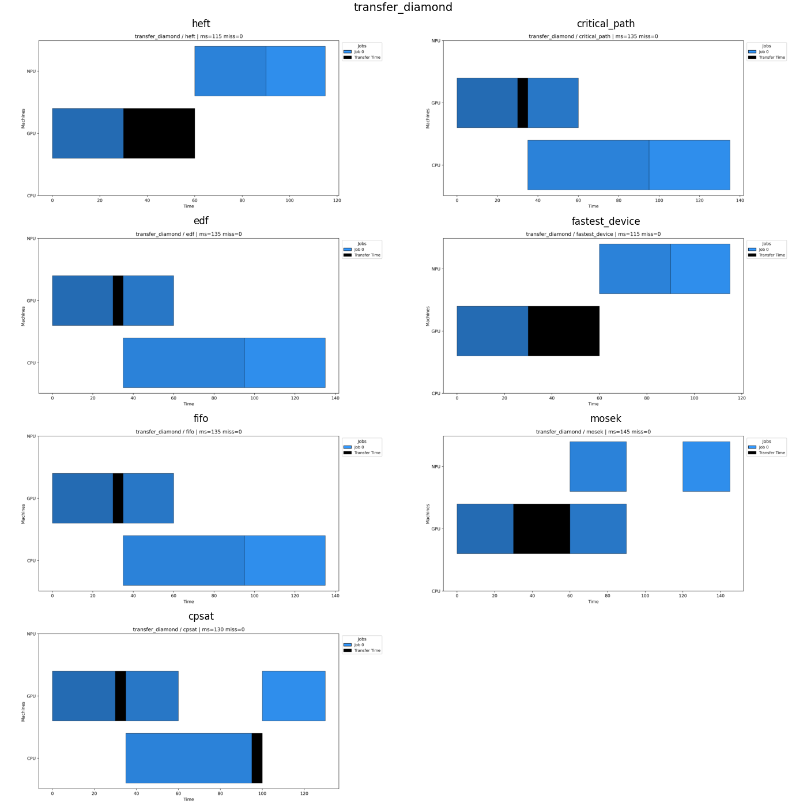
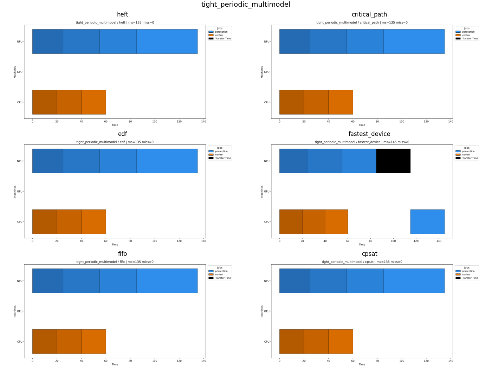
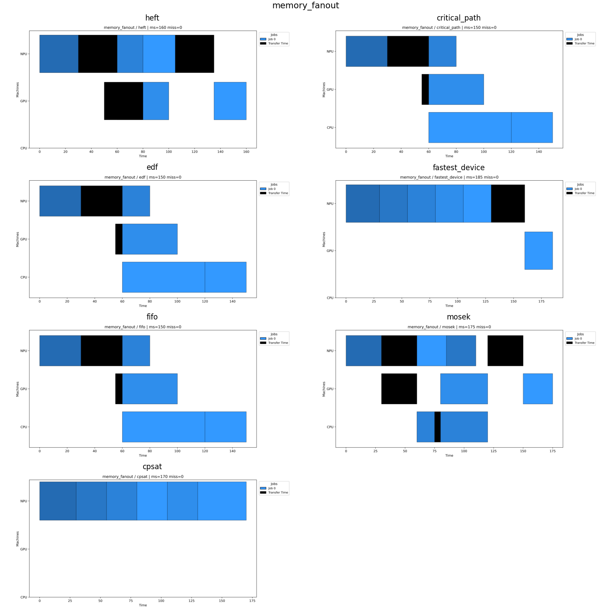
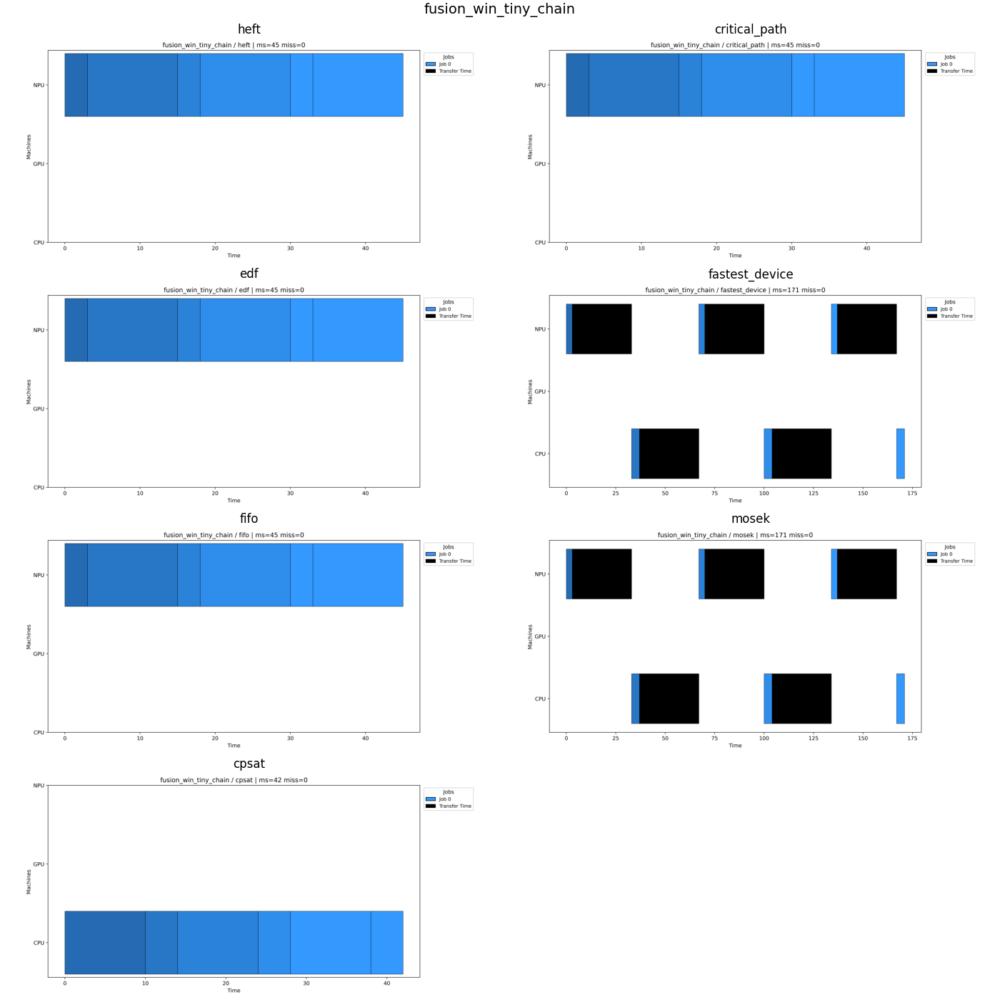
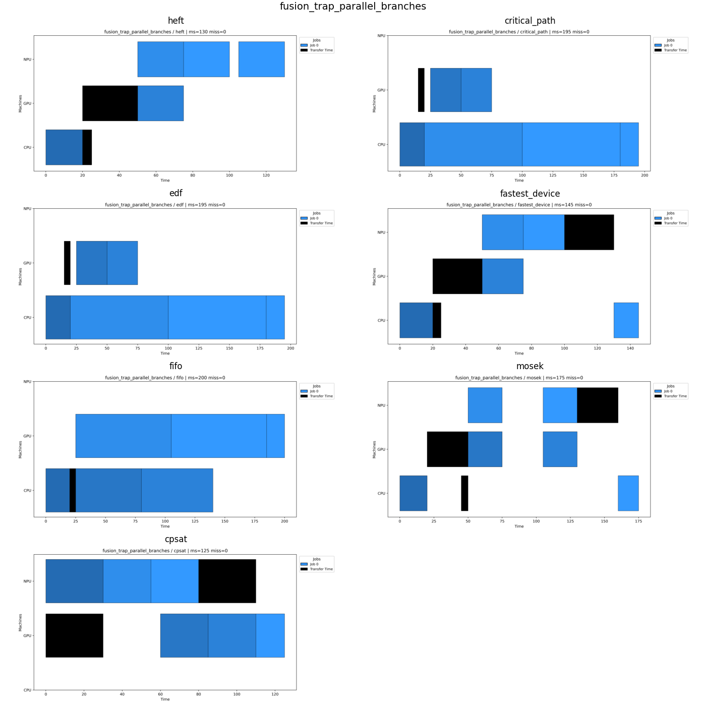
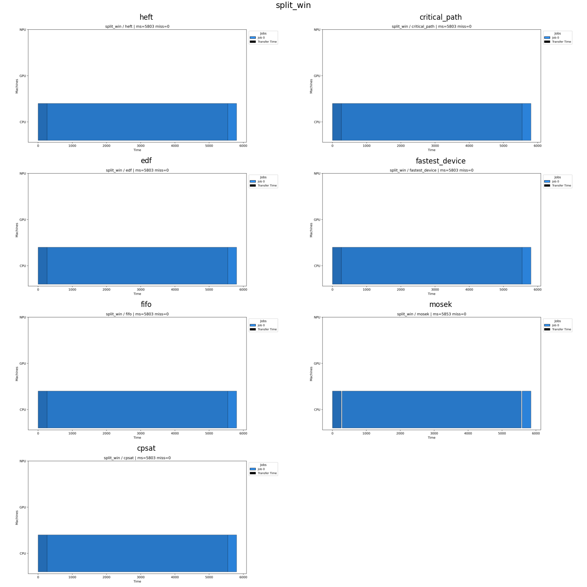
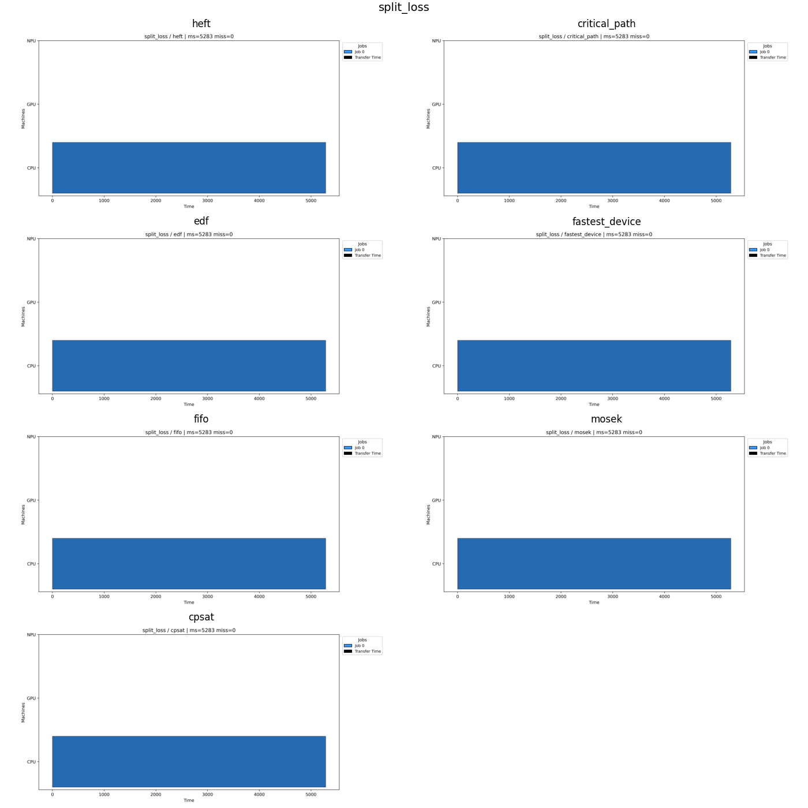

# M6 — Diagnostic scenarios

**Summary: 8 / 11 expectation checks passed.**

- schedulers: ['heft', 'critical_path', 'edf', 'fastest_device', 'fifo', 'mosek', 'cpsat']
- scenarios: ['wide_heft_enough', 'transfer_diamond', 'tight_periodic_multimodel', 'memory_fanout', 'fusion_win_tiny_chain', 'fusion_trap_parallel_branches', 'split_win', 'split_loss']

## wide_heft_enough

| scheduler | makespan_us | misses | total_lateness | cross_device | n_ops |
|---|---:|---:|---:|---:|---:|
| heft | 300.0 | 0 | 0.0 | 0 | 8 |
| critical_path | 300.0 | 0 | 0.0 | 0 | 8 |
| edf | 300.0 | 0 | 0.0 | 0 | 8 |
| fastest_device | 300.0 | 0 | 0.0 | 0 | 8 |
| fifo | 300.0 | 0 | 0.0 | 0 | 8 |
| mosek | 300.0 | 0 | 0.0 | 0 | 8 |
| cpsat | 300.0 | 0 | 0.0 | 0 | 8 |

Expectation checks:
- PASS  metric `makespan_us` expected best in `['heft', 'fifo', 'critical_path', 'edf', 'fastest_device', 'cpsat', 'mosek']` observed best `['mosek']`

## transfer_diamond

| scheduler | makespan_us | misses | total_lateness | cross_device | n_ops |
|---|---:|---:|---:|---:|---:|
| heft | 115.0 | 0 | 0.0 | 2 | 4 |
| critical_path | 135.0 | 0 | 0.0 | 2 | 4 |
| edf | 135.0 | 0 | 0.0 | 2 | 4 |
| fastest_device | 115.0 | 0 | 0.0 | 2 | 4 |
| fifo | 135.0 | 0 | 0.0 | 2 | 4 |
| mosek | 145.0 | 0 | 0.0 | 2 | 4 |
| cpsat | 130.0 | 0 | 0.0 | 2 | 4 |

Expectation checks:
- PASS  metric `cross_device_transitions` expected best in `['heft', 'cpsat', 'mosek']` observed best `['heft', 'critical_path', 'edf', 'fastest_device', 'fifo', 'mosek', 'cpsat']`
- PASS  metric `makespan_us` expected best in `['heft', 'cpsat', 'mosek']` observed best `['heft', 'fastest_device']`
- WARN  metric `makespan_us (negative)` expected best in `NOT ['fastest_device']` observed best `['heft', 'fastest_device']`

## tight_periodic_multimodel

| scheduler | makespan_us | misses | total_lateness | cross_device | n_ops |
|---|---:|---:|---:|---:|---:|
| heft | 135.0 | 0 | 0.0 | 0 | 7 |
| critical_path | 135.0 | 0 | 0.0 | 0 | 7 |
| edf | 135.0 | 0 | 0.0 | 0 | 7 |
| fastest_device | 145.0 | 0 | 0.0 | 1 | 7 |
| fifo | 135.0 | 0 | 0.0 | 0 | 7 |
| cpsat | 135.0 | 0 | 0.0 | 0 | 7 |

Expectation checks:
- PASS  metric `deadline_miss_count` expected best in `['edf', 'cpsat', 'mosek']` observed best `['heft', 'critical_path', 'edf', 'fastest_device', 'fifo', 'cpsat']`
- WARN  metric `deadline_miss_count (negative)` expected best in `NOT ['heft', 'fastest_device']` observed best `['heft', 'critical_path', 'edf', 'fastest_device', 'fifo', 'cpsat']`

## memory_fanout

| scheduler | makespan_us | misses | total_lateness | cross_device | n_ops |
|---|---:|---:|---:|---:|---:|
| heft | 160.0 | 0 | 0.0 | 4 | 6 |
| critical_path | 150.0 | 0 | 0.0 | 5 | 6 |
| edf | 150.0 | 0 | 0.0 | 5 | 6 |
| fastest_device | 185.0 | 0 | 0.0 | 4 | 6 |
| fifo | 150.0 | 0 | 0.0 | 5 | 6 |
| mosek | 175.0 | 0 | 0.0 | 5 | 6 |
| cpsat | 170.0 | 0 | 0.0 | 0 | 6 |

Expectation checks:
- FAIL  metric `makespan_us` expected best in `['heft', 'cpsat', 'mosek']` observed best `['critical_path', 'edf', 'fifo']`

## fusion_win_tiny_chain

| scheduler | makespan_us | misses | total_lateness | cross_device | n_ops |
|---|---:|---:|---:|---:|---:|
| heft | 45.0 | 0 | 0.0 | 0 | 6 |
| critical_path | 45.0 | 0 | 0.0 | 0 | 6 |
| edf | 45.0 | 0 | 0.0 | 0 | 6 |
| fastest_device | 171.0 | 0 | 0.0 | 5 | 6 |
| fifo | 45.0 | 0 | 0.0 | 0 | 6 |
| mosek | 171.0 | 0 | 0.0 | 5 | 6 |
| cpsat | 42.0 | 0 | 0.0 | 0 | 6 |

Expectation checks:
- PASS  metric `cross_device_transitions` expected best in `['heft', 'cpsat', 'mosek']` observed best `['heft', 'critical_path', 'edf', 'fifo', 'cpsat']`

## fusion_trap_parallel_branches

| scheduler | makespan_us | misses | total_lateness | cross_device | n_ops |
|---|---:|---:|---:|---:|---:|
| heft | 130.0 | 0 | 0.0 | 3 | 6 |
| critical_path | 195.0 | 0 | 0.0 | 2 | 6 |
| edf | 195.0 | 0 | 0.0 | 2 | 6 |
| fastest_device | 145.0 | 0 | 0.0 | 4 | 6 |
| fifo | 200.0 | 0 | 0.0 | 2 | 6 |
| mosek | 175.0 | 0 | 0.0 | 4 | 6 |
| cpsat | 125.0 | 0 | 0.0 | 2 | 6 |

Expectation checks:
- PASS  metric `makespan_us` expected best in `['heft', 'cpsat', 'mosek']` observed best `['cpsat']`

## split_win

| scheduler | makespan_us | misses | total_lateness | cross_device | n_ops |
|---|---:|---:|---:|---:|---:|
| heft | 5803.0 | 0 | 0.0 | 0 | 3 |
| critical_path | 5803.0 | 0 | 0.0 | 0 | 3 |
| edf | 5803.0 | 0 | 0.0 | 0 | 3 |
| fastest_device | 5803.0 | 0 | 0.0 | 0 | 3 |
| fifo | 5803.0 | 0 | 0.0 | 0 | 3 |
| mosek | 5853.0 | 0 | 0.0 | 0 | 3 |
| cpsat | 5803.0 | 0 | 0.0 | 0 | 3 |

Expectation checks:
- PASS  metric `makespan_us` expected best in `['heft', 'cpsat', 'mosek']` observed best `['heft', 'critical_path', 'edf', 'fastest_device', 'fifo', 'cpsat']`

## split_loss

| scheduler | makespan_us | misses | total_lateness | cross_device | n_ops |
|---|---:|---:|---:|---:|---:|
| heft | 5283.0 | 0 | 0.0 | 0 | 1 |
| critical_path | 5283.0 | 0 | 0.0 | 0 | 1 |
| edf | 5283.0 | 0 | 0.0 | 0 | 1 |
| fastest_device | 5283.0 | 0 | 0.0 | 0 | 1 |
| fifo | 5283.0 | 0 | 0.0 | 0 | 1 |
| mosek | 5283.0 | 0 | 0.0 | 0 | 1 |
| cpsat | 5283.0 | 0 | 0.0 | 0 | 1 |

Expectation checks:
- PASS  metric `makespan_us` expected best in `['heft', 'cpsat', 'mosek', 'fastest_device', 'edf', 'critical_path', 'fifo']` observed best `['heft', 'critical_path', 'edf', 'fastest_device', 'fifo', 'mosek', 'cpsat']`
