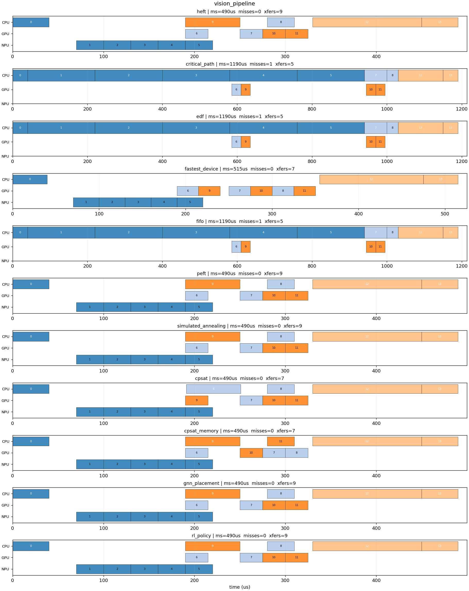
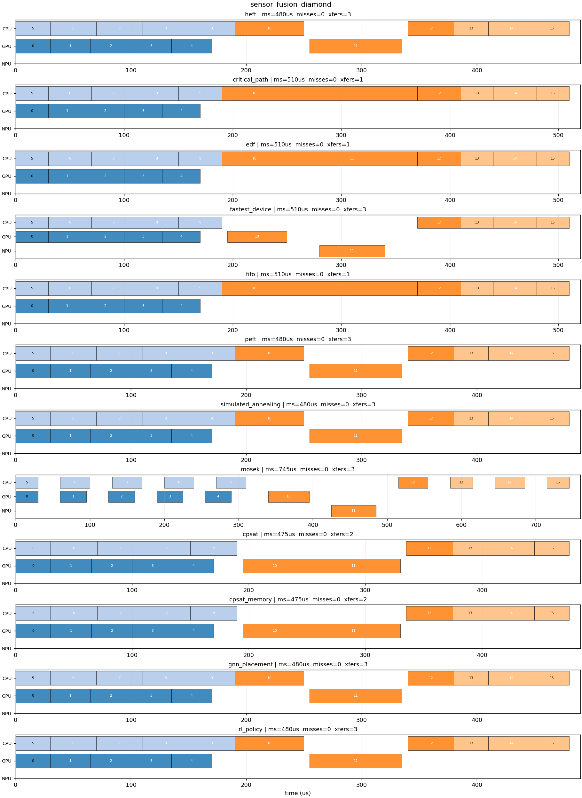
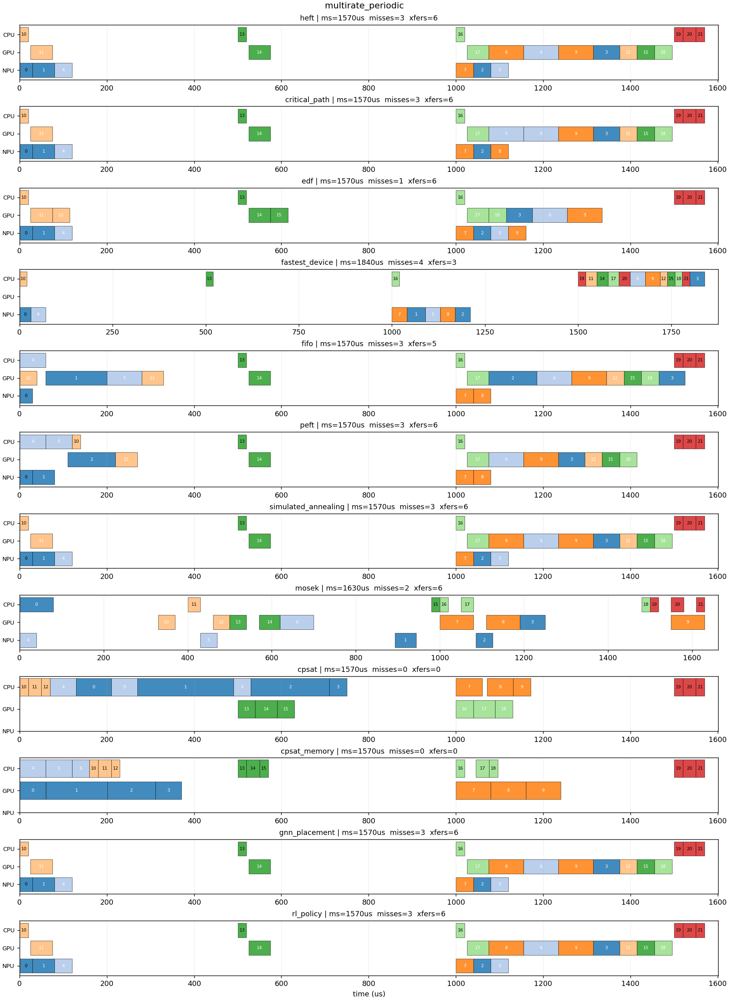
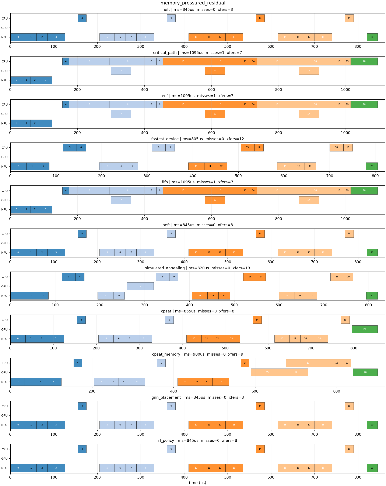
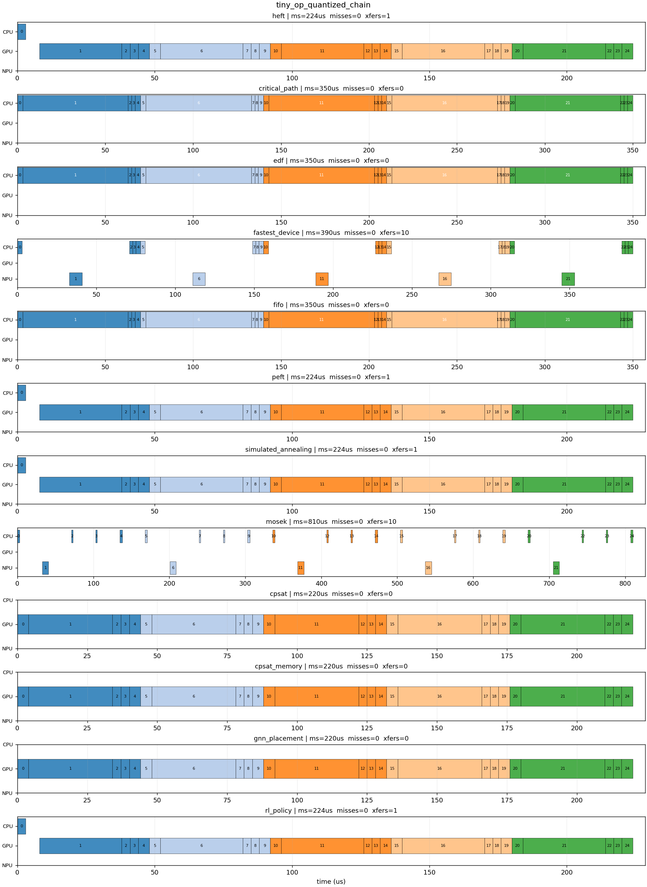
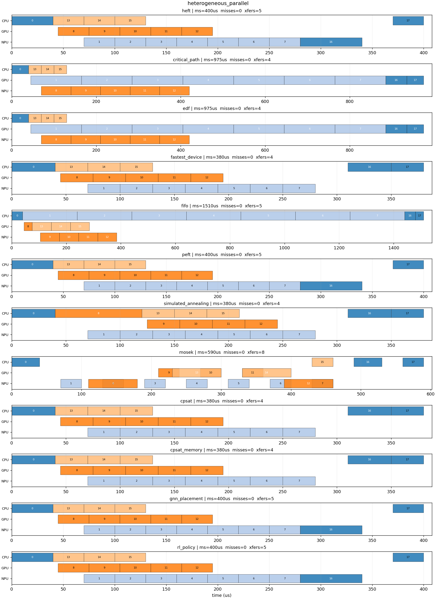
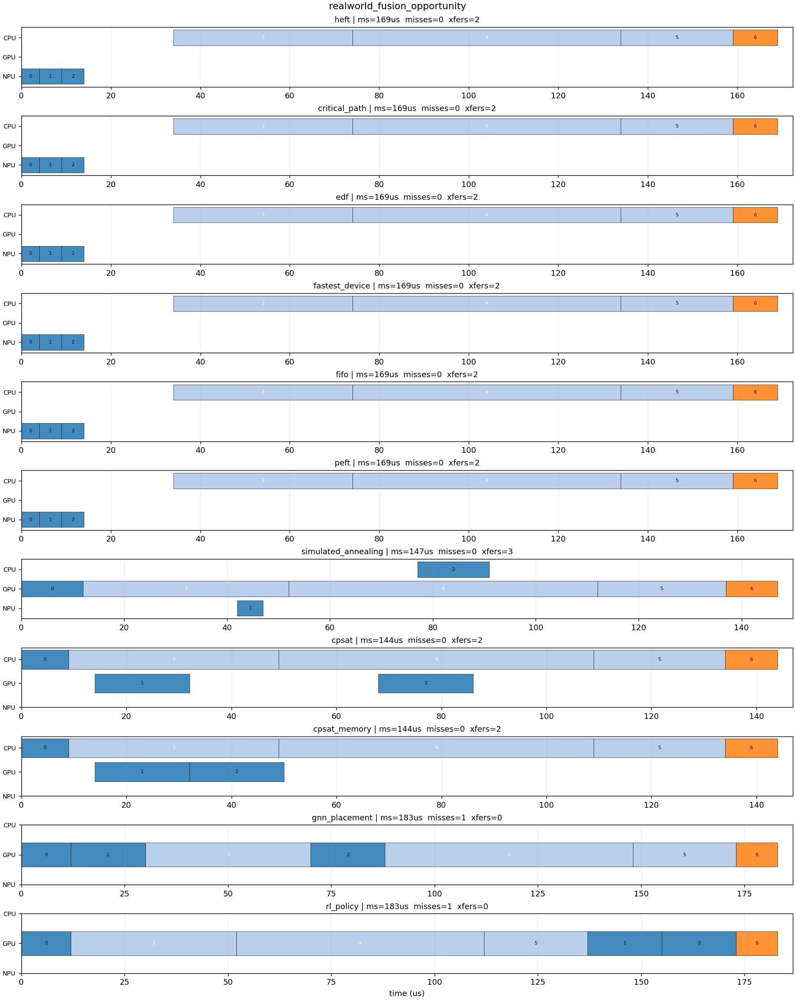
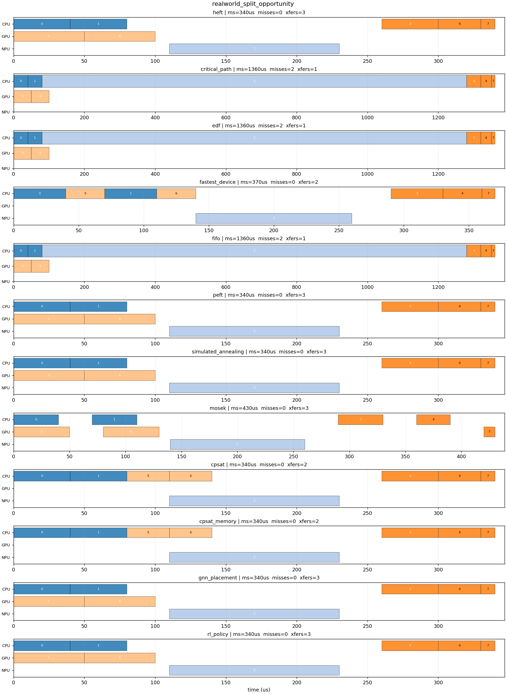
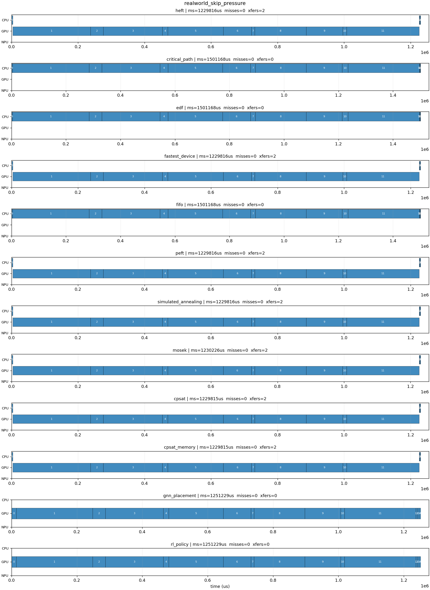

# M6 — Diagnostic scenarios

**Summary: 13 / 15 expectation checks passed.**

- schedulers: ['heft', 'critical_path', 'edf', 'fastest_device', 'fifo', 'peft', 'simulated_annealing', 'mosek', 'cpsat', 'cpsat_memory', 'gnn_placement', 'rl_policy']
- scenarios: ['vision_pipeline', 'sensor_fusion_diamond', 'multirate_periodic', 'memory_pressured_residual', 'tiny_op_quantized_chain', 'heterogeneous_parallel', 'realworld_fusion_opportunity', 'realworld_split_opportunity', 'realworld_skip_pressure']

## Scoreboard (across all scenarios x metrics)

| scheduler | wins | losses |
|---|---:|---:|
| heft | 11 | 5 |
| critical_path | 10 | 11 |
| edf | 10 | 11 |
| fastest_device | 16 | 6 |
| fifo | 13 | 11 |
| peft | 11 | 5 |
| simulated_annealing | 13 | 7 |
| mosek | 2 | 12 |
| cpsat | 21 | 3 |
| cpsat_memory | 21 | 2 |
| gnn_placement | 13 | 9 |
| rl_policy | 11 | 7 |

## vision_pipeline

| scheduler | makespan_us | misses | total_lateness | cross_device | n_ops |
|---|---:|---:|---:|---:|---:|
| heft | 490.0 | 0 | 0.0 | 9 | 14 |
| critical_path | 1190.0 | 1 | 590.0 | 5 | 14 |
| edf | 1190.0 | 1 | 590.0 | 5 | 14 |
| fastest_device | 515.0 | 0 | 0.0 | 7 | 14 |
| fifo | 1190.0 | 1 | 590.0 | 5 | 14 |
| peft | 490.0 | 0 | 0.0 | 9 | 14 |
| simulated_annealing | 490.0 | 0 | 0.0 | 9 | 14 |
| cpsat | 490.0 | 0 | 0.0 | 7 | 14 |
| cpsat_memory | 490.0 | 0 | 0.0 | 7 | 14 |
| gnn_placement | 490.0 | 0 | 0.0 | 9 | 14 |
| rl_policy | 490.0 | 0 | 0.0 | 9 | 14 |

Expectation checks:
- PASS  metric `makespan_us` expected best in `['heft', 'cpsat', 'mosek', 'critical_path']` observed best `['heft', 'peft', 'simulated_annealing', 'cpsat', 'cpsat_memory', 'gnn_placement', 'rl_policy']`
- PASS  metric `deadline_miss_count` expected best in `['edf', 'cpsat', 'mosek', 'heft']` observed best `['heft', 'fastest_device', 'peft', 'simulated_annealing', 'cpsat', 'cpsat_memory', 'gnn_placement', 'rl_policy']`

## sensor_fusion_diamond

| scheduler | makespan_us | misses | total_lateness | cross_device | n_ops |
|---|---:|---:|---:|---:|---:|
| heft | 480.0 | 0 | 0.0 | 3 | 16 |
| critical_path | 510.0 | 0 | 0.0 | 1 | 16 |
| edf | 510.0 | 0 | 0.0 | 1 | 16 |
| fastest_device | 510.0 | 0 | 0.0 | 3 | 16 |
| fifo | 510.0 | 0 | 0.0 | 1 | 16 |
| peft | 480.0 | 0 | 0.0 | 3 | 16 |
| simulated_annealing | 480.0 | 0 | 0.0 | 3 | 16 |
| mosek | 745.0 | 0 | 0.0 | 3 | 16 |
| cpsat | 475.0 | 0 | 0.0 | 2 | 16 |
| cpsat_memory | 475.0 | 0 | 0.0 | 2 | 16 |
| gnn_placement | 480.0 | 0 | 0.0 | 3 | 16 |
| rl_policy | 480.0 | 0 | 0.0 | 3 | 16 |

Expectation checks:
- PASS  metric `makespan_us` expected best in `['heft', 'cpsat', 'mosek']` observed best `['cpsat', 'cpsat_memory']`
- PASS  metric `deadline_miss_count` expected best in `['edf', 'cpsat', 'mosek', 'heft']` observed best `['heft', 'critical_path', 'edf', 'fastest_device', 'fifo', 'peft', 'simulated_annealing', 'mosek', 'cpsat', 'cpsat_memory', 'gnn_placement', 'rl_policy']`

## multirate_periodic

| scheduler | makespan_us | misses | total_lateness | cross_device | n_ops |
|---|---:|---:|---:|---:|---:|
| heft | 1570.0 | 3 | 1605.0 | 6 | 22 |
| critical_path | 1570.0 | 3 | 1605.0 | 6 | 22 |
| edf | 1570.0 | 1 | 255.0 | 6 | 22 |
| fastest_device | 1840.0 | 4 | 2960.0 | 3 | 22 |
| fifo | 1570.0 | 3 | 1575.0 | 5 | 22 |
| peft | 1570.0 | 3 | 1365.0 | 6 | 22 |
| simulated_annealing | 1570.0 | 3 | 1605.0 | 6 | 22 |
| mosek | 1630.0 | 2 | 0.0 | 6 | 22 |
| cpsat | 1570.0 | 0 | 0.0 | 0 | 22 |
| cpsat_memory | 1570.0 | 0 | 0.0 | 0 | 22 |
| gnn_placement | 1570.0 | 3 | 1605.0 | 6 | 22 |
| rl_policy | 1570.0 | 3 | 1605.0 | 6 | 22 |

Expectation checks:
- PASS  metric `deadline_miss_count` expected best in `['edf', 'cpsat', 'mosek']` observed best `['cpsat', 'cpsat_memory']`

## memory_pressured_residual

| scheduler | makespan_us | misses | total_lateness | cross_device | n_ops |
|---|---:|---:|---:|---:|---:|
| heft | 845.0 | 0 | 0.0 | 8 | 21 |
| critical_path | 1095.0 | 1 | 195.0 | 7 | 21 |
| edf | 1095.0 | 1 | 195.0 | 7 | 21 |
| fastest_device | 805.0 | 0 | 0.0 | 12 | 21 |
| fifo | 1095.0 | 1 | 195.0 | 7 | 21 |
| peft | 845.0 | 0 | 0.0 | 8 | 21 |
| simulated_annealing | 820.0 | 0 | 0.0 | 13 | 21 |
| cpsat | 855.0 | 0 | 0.0 | 8 | 21 |
| cpsat_memory | 900.0 | 0 | 0.0 | 9 | 21 |
| gnn_placement | 845.0 | 0 | 0.0 | 8 | 21 |
| rl_policy | 845.0 | 0 | 0.0 | 8 | 21 |

Expectation checks:
- PASS  metric `makespan_us` expected best in `['heft', 'cpsat', 'mosek', 'fastest_device', 'peft', 'simulated_annealing', 'gnn_placement']` observed best `['fastest_device']`
- skip  metric `peak_memory_bytes` expected best in `['cpsat_memory']` observed best `None`

## tiny_op_quantized_chain

| scheduler | makespan_us | misses | total_lateness | cross_device | n_ops |
|---|---:|---:|---:|---:|---:|
| heft | 224.0 | 0 | 0.0 | 1 | 25 |
| critical_path | 350.0 | 0 | 0.0 | 0 | 25 |
| edf | 350.0 | 0 | 0.0 | 0 | 25 |
| fastest_device | 390.0 | 0 | 0.0 | 10 | 25 |
| fifo | 350.0 | 0 | 0.0 | 0 | 25 |
| peft | 224.0 | 0 | 0.0 | 1 | 25 |
| simulated_annealing | 224.0 | 0 | 0.0 | 1 | 25 |
| mosek | 810.0 | 0 | 0.0 | 10 | 25 |
| cpsat | 220.0 | 0 | 0.0 | 0 | 25 |
| cpsat_memory | 220.0 | 0 | 0.0 | 0 | 25 |
| gnn_placement | 220.0 | 0 | 0.0 | 0 | 25 |
| rl_policy | 224.0 | 0 | 0.0 | 1 | 25 |

Expectation checks:
- PASS  metric `makespan_us` expected best in `['cpsat', 'heft', 'critical_path', 'edf', 'fifo']` observed best `['cpsat', 'cpsat_memory', 'gnn_placement']`
- PASS  metric `cross_device_transitions` expected best in `['cpsat', 'heft', 'critical_path', 'edf', 'fifo']` observed best `['critical_path', 'edf', 'fifo', 'cpsat', 'cpsat_memory', 'gnn_placement']`

## heterogeneous_parallel

| scheduler | makespan_us | misses | total_lateness | cross_device | n_ops |
|---|---:|---:|---:|---:|---:|
| heft | 400.0 | 0 | 0.0 | 5 | 18 |
| critical_path | 975.0 | 0 | 0.0 | 4 | 18 |
| edf | 975.0 | 0 | 0.0 | 4 | 18 |
| fastest_device | 380.0 | 0 | 0.0 | 4 | 18 |
| fifo | 1510.0 | 0 | 0.0 | 5 | 18 |
| peft | 400.0 | 0 | 0.0 | 5 | 18 |
| simulated_annealing | 380.0 | 0 | 0.0 | 4 | 18 |
| mosek | 590.0 | 0 | 0.0 | 8 | 18 |
| cpsat | 380.0 | 0 | 0.0 | 4 | 18 |
| cpsat_memory | 380.0 | 0 | 0.0 | 4 | 18 |
| gnn_placement | 400.0 | 0 | 0.0 | 5 | 18 |
| rl_policy | 400.0 | 0 | 0.0 | 5 | 18 |

Expectation checks:
- PASS  metric `makespan_us` expected best in `['heft', 'cpsat', 'mosek', 'critical_path', 'fastest_device', 'simulated_annealing']` observed best `['fastest_device', 'simulated_annealing', 'cpsat', 'cpsat_memory']`

## realworld_fusion_opportunity

| scheduler | makespan_us | misses | total_lateness | cross_device | n_ops |
|---|---:|---:|---:|---:|---:|
| heft | 169.0 | 0 | 0.0 | 2 | 7 |
| critical_path | 169.0 | 0 | 0.0 | 2 | 7 |
| edf | 169.0 | 0 | 0.0 | 2 | 7 |
| fastest_device | 169.0 | 0 | 0.0 | 2 | 7 |
| fifo | 169.0 | 0 | 0.0 | 2 | 7 |
| peft | 169.0 | 0 | 0.0 | 2 | 7 |
| simulated_annealing | 147.0 | 0 | 0.0 | 3 | 7 |
| cpsat | 144.0 | 0 | 0.0 | 2 | 7 |
| cpsat_memory | 144.0 | 0 | 0.0 | 2 | 7 |
| gnn_placement | 183.0 | 1 | 3.0 | 0 | 7 |
| rl_policy | 183.0 | 1 | 3.0 | 0 | 7 |

Expectation checks:
- PASS  metric `makespan_us` expected best in `['heft', 'cpsat', 'peft', 'simulated_annealing', 'mosek']` observed best `['cpsat', 'cpsat_memory']`
- PASS  metric `cross_device_transitions` expected best in `['heft', 'peft', 'cpsat', 'simulated_annealing', 'gnn_placement']` observed best `['gnn_placement', 'rl_policy']`

## realworld_split_opportunity

| scheduler | makespan_us | misses | total_lateness | cross_device | n_ops |
|---|---:|---:|---:|---:|---:|
| heft | 340.0 | 0 | 0.0 | 3 | 8 |
| critical_path | 1360.0 | 2 | 1810.0 | 1 | 8 |
| edf | 1360.0 | 2 | 1810.0 | 1 | 8 |
| fastest_device | 370.0 | 0 | 0.0 | 2 | 8 |
| fifo | 1360.0 | 2 | 1810.0 | 1 | 8 |
| peft | 340.0 | 0 | 0.0 | 3 | 8 |
| simulated_annealing | 340.0 | 0 | 0.0 | 3 | 8 |
| mosek | 430.0 | 0 | 0.0 | 3 | 8 |
| cpsat | 340.0 | 0 | 0.0 | 2 | 8 |
| cpsat_memory | 340.0 | 0 | 0.0 | 2 | 8 |
| gnn_placement | 340.0 | 0 | 0.0 | 3 | 8 |
| rl_policy | 340.0 | 0 | 0.0 | 3 | 8 |

Expectation checks:
- PASS  metric `makespan_us` expected best in `['heft', 'cpsat', 'mosek', 'peft', 'simulated_annealing']` observed best `['heft', 'peft', 'simulated_annealing', 'cpsat', 'cpsat_memory', 'gnn_placement', 'rl_policy']`

## realworld_skip_pressure

| scheduler | makespan_us | misses | total_lateness | cross_device | n_ops |
|---|---:|---:|---:|---:|---:|
| heft | 1229816.2 | 0 | 0.0 | 2 | 15 |
| critical_path | 1501168.4 | 0 | 0.0 | 0 | 15 |
| edf | 1501168.4 | 0 | 0.0 | 0 | 15 |
| fastest_device | 1229816.2 | 0 | 0.0 | 2 | 15 |
| fifo | 1501168.4 | 0 | 0.0 | 0 | 15 |
| peft | 1229816.2 | 0 | 0.0 | 2 | 15 |
| simulated_annealing | 1229816.2 | 0 | 0.0 | 2 | 15 |
| mosek | 1230226.2 | 0 | 0.0 | 2 | 15 |
| cpsat | 1229814.9 | 0 | 0.0 | 2 | 15 |
| cpsat_memory | 1229814.9 | 0 | 0.0 | 2 | 15 |
| gnn_placement | 1251228.8 | 0 | 0.0 | 0 | 15 |
| rl_policy | 1251228.8 | 0 | 0.0 | 0 | 15 |

Expectation checks:
- skip  metric `peak_dram_bytes` expected best in `['cpsat_memory']` observed best `None`
- PASS  metric `makespan_us` expected best in `['cpsat', 'heft', 'peft']` observed best `['cpsat', 'cpsat_memory']`
