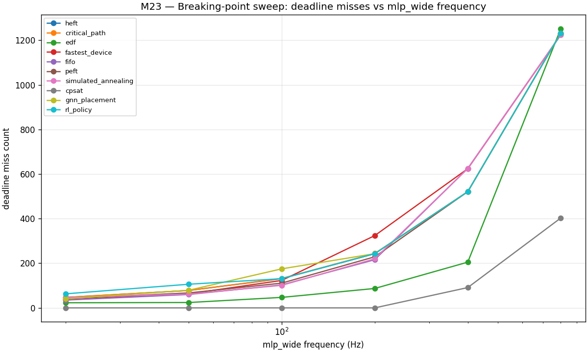

# M23 — Stress-test scenarios

## dominator_packing

Workload size: 360 ops

| scheduler | makespan_us | misses | total_lateness_us | solver_s |
|---|---:|---:|---:|---:|
| heft | 984813 | 150 | 67739749 | 0.031 |
| critical_path | 984813 | 150 | 67766229 | 0.029 |
| edf | 1034501 | 56 | 25887601 | 0.026 |
| fastest_device | 1006260 | 131 | 56761432 | 0.024 |
| fifo | 981300 | 125 | 54169206 | 0.024 |
| peft | 983900 | 150 | 67345947 | 0.038 |
| simulated_annealing | 983120 | 124 | 54707614 | 1.828 |
| cpsat | 980780 | 0 | 0 | 0.693 |
| gnn_placement | 1066847 | 147 | 66896920 | 2.461 |
| rl_policy | 984813 | 150 | 67739749 | 0.255 |

## multi_granularity_dronet

Workload size: 31 ops

| scheduler | makespan_us | misses | total_lateness_us | solver_s |
|---|---:|---:|---:|---:|
| heft | 150780 | 2 | 52530 | 0.001 |
| critical_path | 150780 | 2 | 52530 | 0.001 |
| edf | 150780 | 1 | 37828 | 0.001 |
| fastest_device | 152340 | 3 | 155460 | 0.000 |
| fifo | 150780 | 2 | 52530 | 0.000 |
| peft | 150780 | 2 | 52530 | 0.001 |
| simulated_annealing | 150780 | 2 | 52530 | 0.040 |
| cpsat | 150780 | 0 | 0 | 0.046 |
| gnn_placement | 150780 | 2 | 52530 | 0.003 |
| rl_policy | 150780 | 2 | 52530 | 0.009 |

## mixed_size_stack

Workload size: 199 ops

| scheduler | makespan_us | misses | total_lateness_us | solver_s |
|---|---:|---:|---:|---:|
| heft | 480780 | 61 | 11074298 | 0.014 |
| critical_path | 480780 | 61 | 11082573 | 0.009 |
| edf | 496271 | 26 | 6194189 | 0.009 |
| fastest_device | 493660 | 47 | 8151244 | 0.008 |
| fifo | 480780 | 46 | 7628936 | 0.008 |
| peft | 480780 | 57 | 9523439 | 0.010 |
| simulated_annealing | 480780 | 61 | 11074298 | 0.601 |
| cpsat | 480780 | 0 | 0 | 0.516 |
| gnn_placement | 496660 | 69 | 11420242 | 0.016 |
| rl_policy | 495139 | 85 | 17299672 | 0.051 |

## solver_killer

Workload size: 333 ops

| scheduler | makespan_us | misses | total_lateness_us | solver_s |
|---|---:|---:|---:|---:|
| heft | 420480 | 163 | 29895750 | 0.023 |
| critical_path | 420480 | 163 | 29899698 | 0.023 |
| edf | 460597 | 79 | 10260372 | 0.022 |
| fastest_device | 411060 | 162 | 24070763 | 0.020 |
| fifo | 410786 | 136 | 21265030 | 0.020 |
| peft | 422574 | 163 | 29772024 | 0.024 |
| simulated_annealing | 403480 | 137 | 20904815 | 1.479 |
| cpsat | 392020 | 0 | 0 | 3.054 |
| gnn_placement | 420480 | 163 | 29895750 | 0.041 |
| rl_policy | 420480 | 163 | 29895750 | 0.111 |

## frequency_sweep_breaking_point

| scheduler | mlp=20Hz | mlp=50Hz | mlp=100Hz | mlp=200Hz | mlp=400Hz | mlp=800Hz |
|---|---:|---:|---:|---:|---:|---:|
| heft | 47 | 78 | 131 | 243 | 521 | 1232 |
| critical_path | 47 | 78 | 132 | 244 | 521 | 1232 |
| edf | 23 | 24 | 47 | 87 | 205 | 1252 |
| fastest_device | 36 | 63 | 123 | 324 | 624 | 1224 |
| fifo | 35 | 60 | 103 | 216 | 625 | 1225 |
| peft | 42 | 67 | 111 | 229 | 521 | 1232 |
| simulated_annealing | 47 | 62 | 101 | 220 | 625 | 1225 |
| cpsat | 0 | 0 | 0 | 0 | 91 | 403 |
| gnn_placement | 41 | 79 | 175 | 243 | 521 | 1232 |
| rl_policy | 63 | 106 | 131 | 243 | 521 | 1232 |